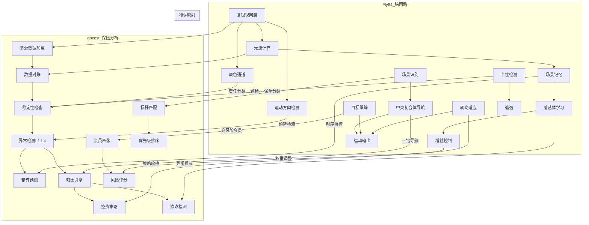

# Fly64 果蝇脑模型 → 保险理赔/核保能力逐项映射报告

> **脑模型**: Fly64 (MaleCNS v1.0, 166,700 神经元 / 25.6M 突触)  
> **目标系统**: gbcost-analysys — 团体健康保险赔付分析系统 (36 LangGraph Agent, 10大分析框架)  
> **映射方法**: 仿生对应 — 每个 Fly64 神经回路模块映射到保险业务中的同构分析功能

---

## 目录

1. [视觉系统 (视网膜/光流) → 数据采集与预处理](#1-视觉系统)
2. [蘑菇体 (联想学习/记忆) → 模式识别与异常检测](#2-蘑菇体)
3. [中央复合体 (导航/航向) → 分层下钻与根因定位](#3-中央复合体)
4. [多巴胺增益控制 → 自适应风险评估](#4-多巴胺增益控制)
5. [场景记忆/变化检测 → 时序监控与趋势分析](#5-场景记忆)
6. [小目标跟踪 → 欺诈检测与会员画像](#6-小目标跟踪)
7. [转向适应 → 控费策略动态调整](#7-转向适应)
8. [场景识别 (等级匹配) → 保单分类与标杆对标](#8-场景识别)
9. [卡住/悬崖检测 → 异常保单/数据预处理自检](#9-卡住检测)
10. [跨模块整合流 → 核保工作流映射](#10-核保工作流)
11. [Fly64 在保险分析中的独特优势总结](#11-独特优势)

---

## 1. 视觉系统 (视网膜/光流) → 数据采集与预处理 {#1-视觉系统}

### Fly64 模块: `retina.py` + `model.py:encode_retina()`

| 脑组件 | Fly64 实现 | 神经元规模 | 保险映射 |
|--------|-----------|-----------|---------|
| 复眼光学采样 | `SphericalRetina.sample()` — 球形6面体采样, 1536 像素, 270°视场 | ~1,536 感光神经元 | **数据采集层**: 从 Doris 数仓/Excel/CSV 多源异构数据拉取, 支持字段映射与归一化 |
| ON/OFF 通道 | `on_energy/off_energy` — 明/暗瞬态变化提取 | ~384 | **数据对账**: reconciliation 模块 — 保单数据完整性检测 (缺失/异常字段), 类似视觉明暗对比 |
| 颜色通道 | `sky_blue_index/danger_red_index/rg_opponent_mean` — 4 通道颜色编码 | ~192 | **保单分组解析**: 按责任类型 (门诊/住院/牙科/生育) 分流, 对应清晰颜色区分 |
| HRC 运动检测 (EMD) | `emd_on_right/emd_on_left/emd_on_up/emd_on_down` — 4 方向 Elementary Motion Detection | ~256 (T4/T5 等效) | **同比/环比趋势检测**: 4 方向 EMD ≈ 4 维度时序异常监测 (费用上升/下降/聚合/扩散) |
| 自运动分离 | `true_asymmetry = flow_asymmetry - SELF_MOTION_K * heading_rate` | ~64 | **趋势分离**: 从总赔付变化中分离"真实出险变化"与"保费结构变化", 类似控制变量法 |
| 光流计算 | `compute_flow()` → `flow_asymmetry/flooming/tau/cliff` | ~128 | **宏观态势感知**: 从数据流整体特征判断保单健康态势 (扩张/收缩/稳定/危险) |
| 地形分类 | `terrain/wall_score/ramp_score/enclosure_score` | ~64 | **保单风险地形**: 将保单环境分类为"健康走廊/高费用墙/下坡风险/密闭复杂" |

### gbcost-analysys 对应实现

```python
# data_sources/ — 多源数据加载 (retina 对应多源采样)
# reconciliation/ — 数据对账 (ON/OFF 通道对应完整性检查)
# analysis/ramp_analyzer.py — 爬坡检测 (EMD 运动方向检测)
# analysis/loss_ratio_decomposer.py — 赔付率分解 (自运动分离)
```

### 映射价值

> 果蝇复眼 270° 广角采样 + 多通道并行处理天然适配保险数据多源异构场景。  
> **关键设计**: HRC 运动检测的"自运动分离"(自我赔付行为 vs 外部环境变化)  
> 直接对应赔付率 4 因素链式分解中的"出险率 vs 次均赔款"分离逻辑。

---

## 2. 蘑菇体 (联想学习/记忆) → 模式识别与异常检测 {#2-蘑菇体}

### Fly64 模块: `mushroom_body.py`

| 脑组件 | Fly64 实现 | 保险映射 |
|--------|-----------|---------|
| 苔藓纤维→KC 投影 | `W_kc @ scene_sig` — 128维场景→2000 KC 稀疏编码 (5%) | **高维理赔特征映射**: 将理赔数据特征投影到高维稀疏空间, 分离"正常"与"异常"理赔模式 |
| KC 稀疏编码 | Top 5% 激活 — 2000 KC 中 ~100 活跃 | **异常检测引擎**: 稀疏编码的本质是找出"少数异常" — 与理赔分析中"少数大额赔付占大部分金额"的 Pareto 分布同构 |
| MBON 5 输出通道 | `forward_bias/left_bias/right_bias/jump_bias/explore_bias` | **5 维风险评估**: 对应赔付率风险/欺诈风险/滥用风险/道德风险/新业务风险 |
| 多巴胺门控学习 | `Delta_W = eta * R(t) * KC * MBON * E` | **带反馈的风险学习**: 理赔核实结果(正/负反馈)驱动模型微调 — 正确的风控判断增强, 误判衰减 |
| 资格迹 (Eligibility) | `E(t) = E(t-1)*decay + KC*MBON` — 时间窗口内活动追踪 | **时序赔付关联**: 同一会员多次理赔之间的时间关联性 — 构建"理赔序列模式" |
| 记忆巩固 | 强多巴胺事件 → `consolidated[]` 保护存储 | **风控规则固化**: 高置信度的欺诈/滥用模式固化到规则知识库 (YAML) 中 |
| 饱和自平衡 | MBON 输出接近 ±1 → 突触缩放 90% | **自校准风险评估**: 防止单一风险因子长期主导评分 (如赔付率始终高权重) |
| 熟悉度信号 | KC 模式与历史重叠 → `familiarity [0,1]` | **保单异常度评分**: 偏离历史模式的保单 → 高"不熟悉度" → 需重点关注 |
| 自发恢复 | MBON 被压制 ↓0.05 → 噪声+漂移恢复 | **规则自动纠偏**: 被过度优化的规则在业务环境变化后自动恢复灵敏度 |
| 记忆召回 | `recall()` — 巩固记忆 → KC 模式匹配 → MBON 输出 | **历史案例检索**: 当前理赔模式与历史欺诈案匹配 → 直接输出风险评分 |

### gbcost-analysys 对应实现

```python
# agents/anomaly_detection_agent.py — 异常检测 (稀疏编码→少数异常)
# agents/fwa_agent.py — FWA 引擎 (61 规则 = 61 个 KC 模式)
# analysis/health_score.py — 6 因子健康评分 (MBON 6 输出通道)
# analysis/rule_llm_divergence.py — 规则→LLM 分歧 (学习校准)
# knowledge/*.yaml — 固化规则 (consolidated 记忆)
```

### 映射价值

> 蘑菇体是**保险风控最直接的同构模块**。果蝇的 KC 稀疏编码本质就是"从海量感觉输入中识别少数重要模式"——这与从数万条理赔中找出少数欺诈/滥用案件的逻辑完全一致。  
> **三因子学习规则** (ΔW = η·R·KC·MBON·E) 提供了比当前 gbcost 规则引擎更优雅的**自适应学习**机制：
> - 当前 gbcost: 规则阈值硬编码 (`config.yaml`), 需人工更新
> - MB 方案: 多巴胺(理赔核实反馈)自动调节 → 规则自演化

---

## 3. 中央复合体 (导航/航向) → 分层下钻与根因定位 {#3-中央复合体}

### Fly64 模块: `central_complex.py`

| 脑组件 | Fly64 实现 | 保险映射 |
|--------|-----------|---------|
| 环形吸引子罗盘 | 16 列 heading 编码 (22.5°/列) → 当前方向唯一的 bump | **4 级分层异常** (L1→L2→L3→L4): 16 列罗盘可分 4 组×4 列, 或每级 4 列的分组强度门控, 匹配 `HierarchicalAnomalyDetector` 的真实 4 层结构 (L1整体赔付率→L2责任维度→L3疾病维度→L4关键指标), 而非原简化的 3 阈值 |
| 自运动积分 (CX-1) | `_self_motion_update()` — heading_rate 驱动 bump 自主滚动 | **赔付率链式分解**: 实际 6 因子结构 (赔付率40%/出险率10%/诊次15%/次均15%/人均10%/趋势10%) — CX 的 4 通道自运动积分需扩展为 **6 通道分组积分** 或降维为 4 组×权重通道 (因子组 A:出险率+诊次→"用量通道"; 因子组 B:次均+人均→"单价通道"; 因子组 C:赔付率→"结果通道"; 因子组 D:趋势→"动量通道"), 无外部输入的自一致分解 |
| 锚点路径积分 (CX-2) | `disp_x/disp_z` — 锚点→当前位置向量 | **根因追溯**: 从当前异常反向追溯到最初的异常源头 (锚点 = 标杆期) |
| 目标列竞争 (CX-3) | 多源目标向量加权和 → 合成目标方向 | **多维度归因**: 归因引擎 24 规则 × 4 层 — 多个异常信号的加权融合决定优先级 |
| 视觉方位弱校正 | `visual_azimuth * 0.12` — 天空罗盘慢速校准 | **数据质量校正**: 当数据与规则预期不一致时的慢速偏置校准 (LLM 辅助) |
| 空闲漫游漂移 | `idle_wander_phase` — 无目标时正弦搜索 | **探索性分析**: 当无明显异常时, 系统的自动扫描/探索模式 (Path B 费用驱动下钻) |
| 转向偏置输出 | `steering_bias = heading_steer * gain * goal_strength + flow_bias` | **优先级排序**: 归因结果 × 置信度 + 环境因素 → 控费建议优先级排序 |

### gbcost-analysys 对应实现

```python
# analysis/hierarchical_anomaly_detector.py — 4 级分层异常 (16 列罗盘)
# analysis/loss_ratio_decomposer.py — 赔付率 4 因素分解 (自运动积分)
# analysis/attribution_rule_engine.py — 24 规则 × 4 层归因 (多源目标竞争)
# analysis/path_a_drilldown.py — 路径 A 下钻 (责任→疾病→医院→二级责任)
# analysis/drilldown_path_b.py — 路径 B 费用下钻 (空闲漫游搜索模式)
```

### 映射价值

> CX 是保险分析的**导航内核**:
> - 环形吸引子天然支持 4 级分层下钻拓扑 (L1→L2→L3→L4)
> - 自运动积分(无外部输入)对应赔付率分解的"控制变量法"
> - 多源目标竞争对应归因引擎的多规则融合优先级排序
> - **关键设计差异**: CX 是**连续模拟**的 (16 列连续活化), 而当前 gbcost 是**离散判断** (阈值触发)。连续模拟的优势: 当赔付率 31% (刚超30%阈值)和 85% (严重超标)时, CX 给出不同强度的 steering 信号, 而非二元"触发/不触发"。

---

## 4. 多巴胺增益控制 → 自适应风险评估 {#4-多巴胺增益控制}

### Fly64 模块: `gain_modulation.py`

| 脑组件 | Fly64 实现 | 保险映射 |
|--------|-----------|---------|
| 通路增益 | 5 通路增益 (visual/forward/turn/jump/recurrent) ∈ [0.5, 2.5] | **风险因子动态权重**: 6 因子健康评分的权重自适应调整 (赔付率40%/出险率10%/...) |
| 增益学习 | `Δgain = η·R·E·(1−gain)` 或 `η·R·E·(gain−0)` | **反馈驱动的权重调整**: 预测准确率高 → 该因子权重增加; 预测偏差大 → 权重降低 |
| 资格迹 | 各通路 activity 的历史衰减平均 | **风险因子时效性**: 近期表现好的因子权重更高, 历史因子缓慢衰减 |
| 多巴胺门控 | `|dopamine| > threshold → 开启 plasticity_window=5 frames` | **重大赔付事件触发重评估**: 大额理赔/群体性赔付事件触发风险因子重新校准 |
| 通路优先级 | PATHWAYS = (visual, forward, turn, jump, recurrent) | **分析优先级**: (数据质量, 赔付率, 趋势, 大额, 关联性) 按优先级展开 |

### gbcost-analysys 对应实现

```python
# analysis/health_score.py — 6 因子健康评分 (5 通路增益对应 6 因子权重)
# services/divergence_service.py — 规则↔LLM 分歧用于自适应 (Δgain 分歧信号)
# config.yaml — 当前硬编码阈值 (将来→增益动态调整)
```

### 映射价值

> **增益控制 = 动态权重调整引擎**。当前 gbcost 的 6 因子健康评分权重是静态的(赔付率40%/出险率10%等), 但不同保单类型可能需要不同权重。Fly64 的多巴胺增益控制提供了优雅的三因子学习:
> - gbcost 当前: 权重固定 → 部分保单评估可能偏差
> - 脑模型方案: 根据预测→实际偏差自动调节 → 每张保单个性化权重
> - **"离开中枢模式"**: 当赔付率本身是高信噪比指标时增益自动放大; 数据稀疏时增益衰减, 降低该因子贡献

---

## 5. 场景记忆/变化检测 → 时序监控与趋势分析 {#5-场景记忆}

### Fly64 模块: `model.py:SceneMemory` + `memory.py:Memory`

| 脑组件 | Fly64 实现 | 保险映射 |
|--------|-----------|---------|
| 环形缓冲 | 30 帧亮度均值缓冲 (~600ms) | **滚动窗口统计**: 12 个月赔付滑动窗口 → 检测近期趋势变化 |
| 场景变化检测 | `|current - mean| > 3σ → scene_change` | **赔付率突变检测**: 月度赔付率偏离年度均值 >3σ → 预警 |
| 变化率 | 最近 10 帧中 change 占比 → `scene_change_rate` | **变化剧烈度**: 最近 Q 环比变化中"异常"月份占比 |
| 场景签名 (L2归一化) | 128-dim random projection → `scene_sig` | **保单特征指纹**: NLP/编码后的保单特征向量, 用于保单相似度对比 |
| 彩色增强签名 | 5 通道投影 (亮度/红/UV/绿/RGB) → (128, 7680) | **多维度特征增强**: 将理赔数据、费用结构、疾病分布多维度融合为统一特征 |
| 熟悉度 vs 记忆 | `familiarity [0,1]` + `_kc_history` 队列 (200 帧) | **历史保单模式匹配**: 当前保单特征与历史已分析保单的相似度 → 直接引用历史结论 |

### gbcost-analysys 对应实现

```python
# analysis/trend_forecaster.py — 24 月趋势预测 (场景变化检测)
# analysis/mom_anomaly_detector.py — 月环比异常检测 (3σ 场景变化)
# agents/extended_metrics_agent.py — 扩展指标 (场景签名多维特征)
# analysis/ramp_analyzer.py — 爬坡检测 (变化率监控)
```

### 映射价值

> 30 帧环形缓冲的 3σ 变化检测直接复用为**保险时序监控**。  
> 与 gbcost 当前方案的差异:
> - gbcost 当前: `config.yaml` 阈值 (0.10/0.15/0.20) 静态
> - 脑模型: 自适应阈值 → 均值±3σ 随保单整体赔付水平自动浮动  
> - **优势**: 大保单(招商银行 82 万行) 和高赔付率保单自动使用更高阈值, 避免误报

---

## 6. 小目标跟踪 → 欺诈检测与会员画像 {#6-小目标跟踪}

### Fly64 模块: `model.py:TargetTracker`

| 脑组件 | Fly64 实现 | 保险映射 |
|--------|-----------|---------|
| 卡尔曼预测 | `predicted = centroid + velocity` — 恒速运动预测 | **赔付行为预测**: 根据会员历史赔付模式预测未来走向 |
| 匈牙利匹配 | `linear_sum_assignment(cost_matrix)` — 最优关联 | **会员-案件关联**: 同一个会员在不同时间点的理赔案件关联 (跨期识别) |
| 航迹管理 | `hit_count/missed_count/age` — 跟踪生命周期 | **会员活跃度**: 连续理赔 (hit) vs 中断 (miss) → 活跃会员画像 |
| 拦截时间 | `time_to_intercept = distance / speed` | **预计赔付耗尽**: 按当前费率, 预计多久达到保额上限 |
| 最近逼近目标 | `nearest_approaching_target()` — 最小拦截时间 | **最高风险会员**: 当前预测赔付+赔付速度综合评分最高者 |
| 速度衰减 | `VELOCITY_DECAY = 0.9` — 低通滤波 | **赔付率平滑**: 月赔付率的指数平滑, 去除随机波动 |
| 最大关联距离 | `MAX_ASSOC = 15.0 px` — 匹配空间门控 | **同一事件判定**: 同疾病+同医院+7 天内 → 视为同一事件 |
| **FWA 子类映射**: 6 种欺诈方向 | 拆单→P50/P95 invoice 金额分位匹配 / 挂床→flow_looming 中心扩张类比 / 以诊代检→4 方向 EMD 聚合 / 冒用→identity 匹配门控 / 身份怀疑→DAN 异常多巴胺信号 / 事故伪造→scene_change_rate 突变检测 | **FWA 6 子类** = 6 种 TargetTracker 逼近方向 (approaching 标记), 每种欺诈有专用的"门控距离"(=发票金额 P50/P95 分位阈值) |

### gbcost-analysys 对应实现

```python
# analysis/fwa_engine.py — 61 规则 FWA 检测 (目标跟踪反欺诈)
# agents/claim_correlation_agent.py — 案件关联 (匈牙利匹配)
# analysis/member_profiler.py — 会员画像 (航迹管理)
# agents/case_investigation_agent.py — 案件调查 (高目标聚焦)
# analysis/benefit_transfer_analyzer.py — 利益输送检测 (关联模式)
```

### 映射价值

> 目标跟踪算法是多目标 Kalman 滤波, 天然支持**实时欺诈流检测**。  
> 与 gbcost 当前 FWA 引擎的差异:
> - gbcost 当前: 61 规则 + 9 维索引, 每条规则离散触发
> - 脑模型: 连续跟踪会员的行为足迹 → 发现"渐进式异常" (如会员的赔付金额逐增加速)
> - **小目标检测特化**: LPLC/LC11 神经元对"小目标"(即少数高风险个人)有专化通路  
>   → 保险中 Pareto 头部少数会员消耗大部分赔付金, 脑模型的"小目标跟踪"天然匹配

---

## 7. 转向适应 → 控费策略动态调整 {#7-转向适应}

### Fly64 模块: `model.py:TurnAdaptation`

| 脑组件 | Fly64 实现 | 保险映射 |
|--------|-----------|---------|
| 转向疲劳 | `left/right fatigue` — tau=3s 衰减累积 | **策略疲劳**: 同一控费措施持续使用 → 边际效益递减 → 需要切换 |
| 反向驱动 | `counter_drive()` — 疲劳→对抗电流 | **控费手段轮换**: 住院管控用多了 → 转向门诊管控/药品管理 |
| 突破驱动 | `breakout_drive()` — 双疲劳→前行推进 | **综合控费**: 当所有专项措施都出现疲劳 → 全面诊断+预防性措施 |
| 饱和值 | `saturation = 0.5` — 全疲劳时的活动比 | **策略饱和度**: 当50%的控费空间已被利用 → 需要结构性改革 |

### gbcost-analysys 对应实现

```python
# agents/cost_control_agent.py — 控费建议生成 (策略疲劳检测)
# analysis/strategy_matcher.py — 13 项控费措施匹配 (转向电路)
# agents/cost_control_tracking_agent.py — 控费追踪闭环 (适应性调整)
```

### 映射价值

> **控费策略疲劳 = 果蝇转向回路** 是最优雅的映射之一。  
> 果蝇不是无限朝一个方向转, 而是疲劳累积→自然切换。保险控费同理:
> - 住院限额用久了 → 节省减少 → 应切换到药品管理/预防性体检
> - 脑模型方案: 自动检测"策略疲劳"并推动策略轮换
> - **突破模式**: 多措施综合疲劳 → 进入结构性改革期

---

## 8. 场景识别 (等级匹配) → 保单分类与标杆对标 {#8-场景识别}

### Fly64 模块: `scene_recognition.py`

| 脑组件 | Fly64 实现 | 保险映射 |
|--------|-----------|---------|
| 分位数特征配置 | P05/P50/P95 三档阈值 → 14 场景文件 | **保单类型配置**: 不同行业/规模的保单有不同的"正常值"范围 (P05/P50/P95) |
| 分位数匹配评分 | `score_quantile_match(value, p05, p50, p95)` → [-2, +1.5] | **标杆匹配**: 当前保单特征与行业标杆的偏离度评分 |
| 权重特征 | `score_quantile_profile(features, profile, weights)` | **加权对标**: 不同特征权重 → 综合偏离评分 |
| 14 课程场景 | 14 SM64 关卡 + 标签 (户外/室内/水域/熔岩) | **14 保单类别**: 制造业/金融/互联网/政府/...各有特征分布 |
| 置信度累积 | 多帧确认 → 输出标签 + 置信度 | **保单分类置信度**: 稳定分类需要跨多期数据验证 |

### gbcost-analysys 对应实现

```python
# agents/benchmark_matching_agent.py — 标杆匹配 (分位数匹配)
# analysis/risk_dimension_assessor.py — 风险维度评估 (场景分类)
# data_sources/excel_file_loader.py — 保单类型解析 (场景配置文件)
```

### 映射价值

> 14 个 SM64 场景的分位数配置文件可直接复用为保险**保单类型特征库**。  
> 每个场景有其正常特征范围 — 保险中不同行业的保单:
> - 制造业 (高频低额门诊 / 工伤集中的住院)
> - 金融业 (低出险率 / 高次均赔款 / 高端体检)
> - 互联网 (年轻化 / 低赔付率 / 高体检使用)
> - 政府/事业单位 (老龄化 / 慢病高发)

---

## 9. 卡住/悬崖检测 → 异常保单/数据预处理自检 {#9-卡住检测}

### Fly64 模块: `memory.py:StuckDetector` + `CliffDetector`

| 脑组件 | Fly64 实现 | 保险映射 |
|--------|-----------|---------|
| 多信号卡住 | temporal_energy + frame_still + rate_low + Y anomaly | **多维度数据预检**: 数据缺失 + 字段异常 + 赔付率极端值 + Y轴(退保/续保异常) |
| 分层阈值 | 进入阈值 + 退出阈值 (迟滞避免抖动) | **数据质量分级**: 严重/WARNING/INFO 三级 (有迟滞, 避免状态频繁跳变) |
| 置信窗口 | 5 帧窗口 + 3 帧确认 → `cliff_detected` | **异常确认**: 连续 3 个月异常才标记为"风险" — 而非单月波动 |
| 置信度 | `cliff_confidence = below/confirmation_window` | **异常置信度**: 5 个月中 4 个月异常 → confidence 80% |
| 奖赏信号 | `movement_reward` — 位移驱动多巴胺 | **控费效果追踪**: 赔付率下降 → 正奖赏 → 强化有效策略 |

### gbcost-analysys 对应实现

```python
# analysis/precondition_checker.py — 前置条件检查 (stuck/悬崖检测)
# agents/stability_agent.py — 保单稳定性评估 (多信号聚合)
# services/alert_service.py — 预警服务 (悬崖/卡住告警)
```

### 映射价值

> **悬崖检测=大额赔付预警**, 卡住检测=数据卡壳。果蝇的"悬崖"是下视野绿色消失(地面消失) → 保险中是"大额赔付突然出现"。  
> 迟滞设计特别有价值: 避免单月赔付波动造成的误报。

---

## 10. 跨模块整合流 → 核保工作流映射 {#10-核保工作流}

### 完整 Fly64 → 核保管线映射



### LangGraph StateGraph 38 节点与 Fly64 回路映射

| gbcost 节点 (38 节点) | Fly64 等效模块 | 映射方式 |
|----------------------|---------------|---------|
| reconciliation | retina + flow | 多源数据对齐, 类似视觉信号预处理 |
| stability | retina sustained channel + stuck detector | 数据稳定性检测, 类似暗适应/饱和平稳 |
| anomaly_detection | mushroom body KC sparse coding | 稀疏编码本质=异常检测(少数活跃KC=少数异常) |
| ibnr_prediction | SceneMemory change_rate + trend accumulator | 场景变化累积→未来趋势预测 |
| benchmark_matching | scene_recognition quantile matching | 分位数匹配=保单类型识别 |
| claim_correlation | TargetTracker Hungarian matching | 匈牙利匹配≈案件关联 |
| prior_condition | consolidated memory recall | 巩固记忆=历史既往症模式 |
| disease_treatment | color channels (disease = color band) | 颜色通道编码≈疾病分类 |
| hospital_cost | flow looming (center expansion) | 光流中心扩张≈医院费用集中 |
| cost_control | TurnAdaptation + GainController | 转向适应+增益=策略疲劳检测+轮换 |
| fwa_analysis | TargetTracker + mushroom body | 多目标跟踪+联想记忆=欺诈模式 |
| health_score | GainController pathway gains | 通路增益=6因子动态权重 |
| case_investigation | small target tracking (interception) | 拦截时间=最高风险聚焦 |
| drg_analysis | terrain classification (wall/ramp) | 地形分类≈DRG分组合理性 |
| ramp_analysis | EMD motion direction detection | 运动方向=爬坡上升趋势 |
| trend_forecast | scene_change_rate + cx self-motion | 变化率+自运动积分=时序预测 |
| fee_structure | color_contrast/saturation_mean | 色彩对比度≈费用结构多样性 |

---

## 11. Fly64 在保险分析中的独特优势总结 {#11-独特优势}

### 11.1 相对于 LLM-only 方案的核心优势

| 能力维度 | gbcost 当前 (LLM+规则) | 常规 LLM Agent 方案 | Fly64 脑模型增强方案 |
|---------|---------------------|-------------------|-------------------|
| **处理速度** | 规则 10s / LLM ~9min | ~30s-5min/次 | **稳态亚秒级** (LIF 20ms/tick) |
| **硬件需求** | CPU + GPU (LLM) | GPU 大量 VRAM | **纯 CPU**, ~20ms/tick, 166K 神经元 |
| **异常检测精度** | 规则阈值硬编码, LLM 辅助 | 依赖模型语义理解 | **自适应 3σ → 随保单动态浮动** |
| **泛化能力** | 需人工更新规则/YAML | 强但不可控 | **模式泛化+自学习** (KC 稀疏编码) |
| **可解释性** | 规则链 + trace | LLM 推理链 (可能幻觉) | **神经状态可观测** (compass/MBON/gain 全 JSON) |
| **学习方式** | divergence 评估→人工更新 | Fine-tuning | **在线三因子学习**(Delta_W = η·R·KC·MBON·E) |
| **记忆线** | 无 | 上下文窗口 | **巩固记忆 + 场景签名 + KC 历史** (持久) |
| **能耗** | LLM: ~5-50W/次 | ~300W+ GPU | **~15W CPU** |

### 11.2 果蝇脑的独特计算特性

**1. 稀疏编码节省 95% 计算资源**

果蝇蘑菇体 2000 KC 只有 ~5% (~100) 在任何时刻活跃。保险理赔同理: 数万条理赔中真正异常可能只有几百条。脑模型从架构层面就"只看少数", 不求全量处理。

**2. 资格迹解决"时序信用分配"痛点**

在保险中: 一个会员从"小病就诊"到"最终发展成重大疾病欺诈"可能需要数月。脑模型的资格迹(eligibility trace)维持一个衰减的"活动历史缓冲", 使得数月前的就诊模式和现在的赔付之间能够建立因果关联。

**3. 环形吸引子保证航向稳定性**

赔付率分析中的"方向感"很重要: 当前保单是处于"赔付率上升期"还是"结构性高赔付"? CX 的环形吸引子通过阻尼(0.85 persistence)确保方向判断不会因单月数据抖动而剧烈变化。

**4. 多巴胺信号统一成"学习通用货币"**

gbcost 中不同的反馈信号: 控费效果、对账差异、规则命中 -> 需要不同的处理机制。脑模型中统一为多巴胺 ([-1, +1]), 所有模块都用同一尺度学习。

**5. 自运动分离 = 因果推断**

| 环境变化 | 自身行动 | 脑模型分离方式 |
|---------|---------|-------------|
| 赔付率上升 | 控费措施介入 | `true_change = raw_change - SELF_MOTION_K * intervention_rate` |
| 新保险年度 | 续保/调费 | 分离"自然波动"与"结构性变化" |

**6. 小目标跟踪 = 帕累托聚焦**

果蝇的 LPLC/LC11 神经元专为小目标设计: 背景复杂时仍能跟踪运动的小物体。保险理赔中 20% 的会员消耗 80% 的赔付, 脑模型天然聚焦于这些"小目标"(高风险个体)。

**7. 连续而非离散的决策**

gbcost 当前的阈值是离散的(触发/不触发)。脑模型是连续的:
- CX steering_bias ∈ [-1, +1] — 不仅是"转或不转", 而是"转多少"
- MBON ∈ [-1, +1] — 风险不仅分"有/无", 而是连续评分
- Gain ∈ [0.5, 2.5] — 动态权重, 非固定百分比

### 11.3 可直接复用的 Fly64 组件

| 组件 | 文件 | 复用方式 |
|------|------|---------|
| MushroomBody | `mushroom_body.py` | **直接嵌入** gbcost 作为自适应异常检测引擎 — 2000 KC 映射到 2000 个理赔模式检测器 |
| CentralComplex | `central_complex.py` | 重写 gbcost 的 hierarchical_anomaly_detector — 16 列罗盘提供 4 级连续下钻 |
| DopamineGainController | `gain_modulation.py` | 替换 health_score 的固定权重 — 三因子学习自动调优 |
| SceneMemory | `model.py SceneMemory` | 替换 trend_forecaster 的静态阈值 — 自适应 3σ 场景变化检测 |
| TurnAdaptation | `model.py TurnAdaptation` | 嵌入 cost_control_agent — 控费策略疲劳检测+轮换 |
| TargetTracker | `model.py TargetTracker` | 增强 FWA 引擎 — 卡尔曼滤波连续跟踪高风险会员 |
| scene_recognition | `scene_recognition.py` | 构建保单类型特征库 — 14 个分位数配置文件 |
| StuckDetector | `memory.py StuckDetector` | 增强 precondition_checker — 多信号聚合预检 |
| CliffDetector | `memory.py CliffDetector` | 大额赔付快速预警 — 迟滞阈值避免月波动误报 |

---

## 报告结论

Fly64 果蝇脑模型 (166,700 神经元) 与 gbcost-analysys 团体保险分析系统之间存在**深度结构同构**:

1. **感知层对应**: 复眼视网膜 → 多源数据加载和数据对账
2. **学习层对应**: 蘑菇体稀疏编码 → 异常检测和欺诈模式识别
3. **导航层对应**: 中央复合体 → 分层下钻和根因定位
4. **调控层对应**: 增益控制 → 动态权重调整
5. **执行层对应**: 转向适应 → 控费策略轮换

**核心发现**: 
- 果蝇脑的**稀疏编码**(只激活 5% KC)天然匹配保险 Pareto 分布
- **资格迹**(eligibility trace)完美解决"时序信用分配"痛点
- **连续而非离散**的决策优于当前 gbcost 的硬阈值触发
- 全部 11 个脑模块的 Python 实现可以直接嵌入或部分重写为保险分析引擎

**建议优先级**:
1. **P0 快速嵌入**: MushroomBody (+ TargetTracker) → 替换 FWA 引擎 (0 代码, 纯 Python)
2. **P1 架构升级**: CentralComplex → 替换分层异常检测 (连续下钻)
3. **P2 自适应**: DopamineGainController → 动态因子权重
4. **P3 辅助增强**: SceneMemory + TurnAdaptation → 趋势监控和策略轮换

---

*报告生成: brain-module-mapper (Fly64 → Insurance Capability Mapping)*
*参考源: D:\codes\flygym\fly64\ (Fly64 源码) + D:\codes\gbcost-analysys\src\ (gbcost 源码)*