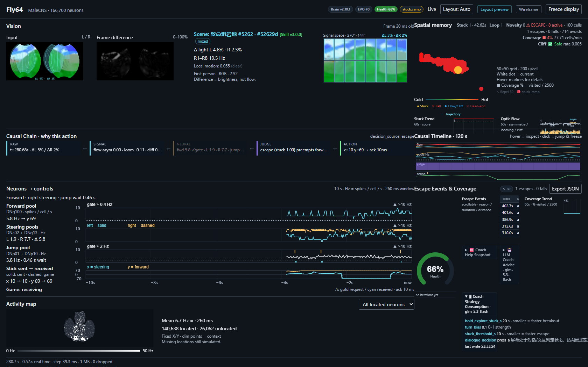
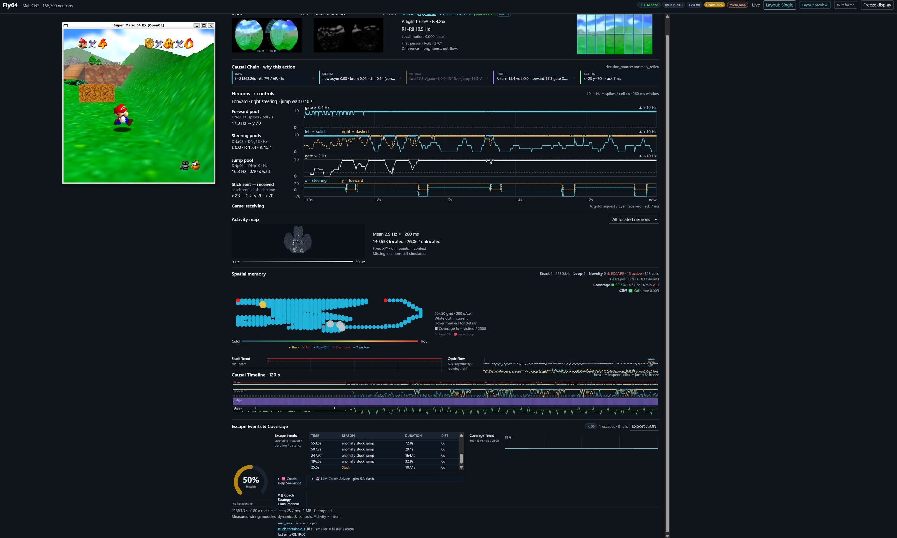
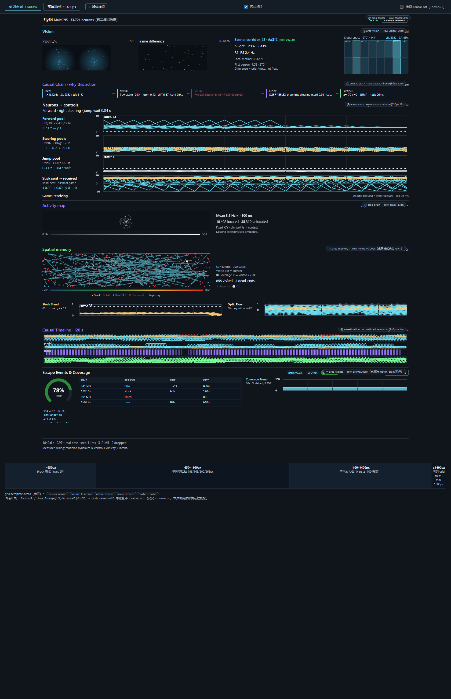
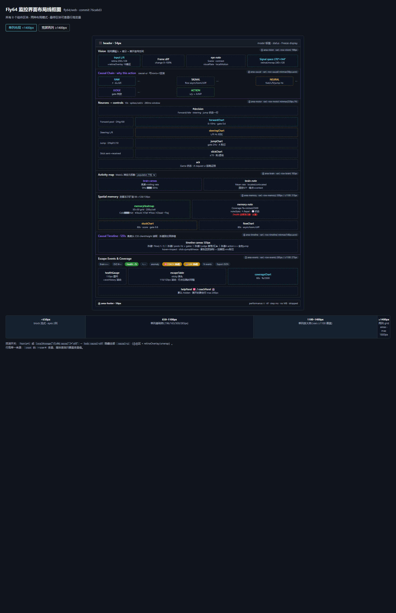
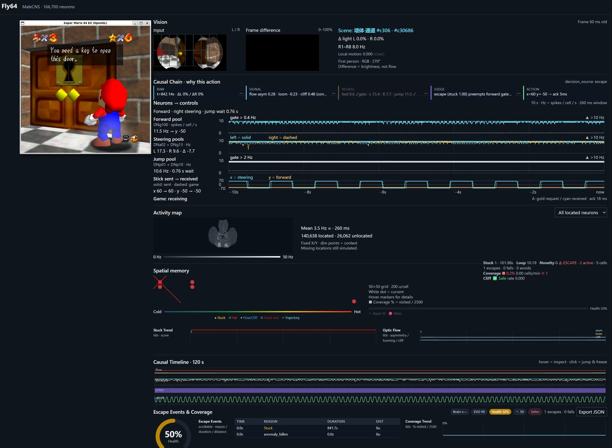

# FruitflyAI — Fly64: 果蝇大脑控制 Super Mario 64

[](https://github.com/rickqi/FruitflyAI)

将果蝇（Drosophila）真实神经连接组（MaleCNS v1.0，**166,700 神经元，2,560 万突触连接**）接入 Super Mario 64，实现完整的视觉→神经→运动控制闭环。

## 🖥️ 支持平台

| 平台 | 状态 | 说明 |
|------|------|------|
| **macOS** (原始) | ✅ | Apple Silicon (M1/M2), Homebrew |
| **WSL2 Ubuntu 22.04** | ✅ **推荐部署方案** | **已验证** — 原生 POSIX 兼容，WSLg GPU 加速 GUI |
| **Linux (Ubuntu 22.04+)** | ✅ | 需 x86_64 + NVIDIA/Intel GPU |
| **原生 Windows** | ❌ | 需要 MSYS2 + Win32 mmap 重写，不推荐 |

### 部署建议

> **推荐方案：WSL2 (Windows Subsystem for Linux)**
>
> 本项目最初仅支持 macOS（Apple Silicon + Homebrew）。我们全面解决了在 **Windows 10/11 上通过 WSL2 运行** 的所有技术障碍，验证了完整的视觉→神经→运动控制闭环。WSL2 提供了与原生 Linux 几乎一致的 POSIX 环境，同时无缝集成 Windows 文件系统和网络。
>
> 相比原生 macOS 方案的不足，WSL 方案提供了更高的硬件可用性和可扩展性。不建议在原生 Windows（MSYS2/MinGW）上运行，因 mmap 共享内存桥接等 POSIX 依赖需大量移植。

## 📋 前置要求

- **操作系统**: Windows 10 2004+ / Windows 11（WSL2 方案）
- **WSL2**: 已启用（`wsl --install -d Ubuntu`）
- **磁盘空间**: 至少 5GB 可用
- **内存**: 建议 8GB+
- **SM64 ROM**: 需要一份**未修改的美版 Super Mario 64 ROM** (`.z64`)

## 🚀 快速开始 (WSL)

### 1. 初始化 WSL 环境

```bash
# 启动 WSL
wsl

# 更新系统包
sudo apt update && sudo apt upgrade -y

# 安装工具链
sudo apt install -y build-essential libsdl2-dev libglew-dev pkg-config \
                    python3 python3-venv python3-pip curl git make
```

### 2. 克隆项目

```bash
git clone https://github.com/rickqi/FruitflyAI.git
cd FruitflyAI/fly64
```

### 3. 设置 Python 环境

```bash
python3 -m venv venv
source venv/bin/activate
pip install -r requirements.txt
```

### 4. 下载脑数据（~1.3GB）

MaleCNS 果蝇连接组数据来自 Google Cloud Storage（中国大陆下载较慢，约 40-60 分钟）：

```bash
# 重要：使用 curl 下载（aria2c 会产生截断文件）
python -m fly64.data --prepare --cache .cache/malecns
```

> **下载慢？** Google Cloud Storage 在中国大陆有带宽限制。如果下载缓慢，可尝试：
> - 使用代理/VPN
> - 夜间下载（速度可能提升）

### 5. 设置 sm64ex 并编译

```bash
# 克隆 sm64ex（如果 GitHub 直连慢，可用 ghfast.top 代理）
git clone https://ghfast.top/https://github.com/sm64pc/sm64ex.git .cache/sm64ex

# 进入目录并切换到指定 commit
cd .cache/sm64ex
git checkout d7ca2c04364a6dd0dac58b47151e04e26887e6f0

# 应用 Fly64 补丁
git apply ../../patches/sm64ex-fly64.patch

# 将 SM64 ROM 放入目录
# cp /path/to/baserom.us.z64 .

# 编译（注意：需要 -lGLEW 链接）
make -j$(nproc) VERSION=us BETTERCAMERA=1 NODRAWINGDISTANCE=1 EXT_OPTIONS_MENU=1

# 如果编译报 GLEW 链接错误，先运行：
sed -i 's/BACKEND_LDFLAGS += -lGL/BACKEND_LDFLAGS += -lGLEW -lGL/' Makefile

cd ../..
```

### 6. 修复桥接兼容性

```bash
# bridge.py 默认仅支持 macOS（Apple Silicon 内存屏障）
# Linux/WSL 需要打补丁（仓库版本已包含此修复）
```

### 7. 运行

#### 合成模式（无需 ROM，展示脑模型）

```bash
source venv/bin/activate
python3 -m fly64.main --bridge /tmp/f64b --record /tmp/f64r.npz \
  --synthetic --demo-model --no-browser --duration 600
```

浏览器打开 **http://127.0.0.1:8765/** 查看仪表板。

#### 完整模式（需要 SM64 ROM）

```bash
source venv/bin/activate
./run-fly64 --rom /path/to/baserom.us.z64
```

或手动启动脑模型 + 游戏：

> **⚠️ 启动契约（强制）**：常驻运行的大脑与 SM64 **必须用 `setsid nohup … &`（输出重定向 + `</dev/null`）脱离宿主 shell**。禁止把它们作为托管后台 job（pwsh `run_in_background` / agent 后台 job / 交互终端前台子进程）直接启动——宿主会话结束或 job 被回收时进程会被连带 kill，导致共享内存桥冻结、仪表板卡死。规范化入口：`scripts/consolidate.sh`。

```bash
# 常驻启动（契约方式，WSL）：
cd /root/fly64
setsid nohup python3 -m fly64.main --bridge /tmp/f64b_traj \
  --record /tmp/f64r_traj.npz --no-browser --duration 0 > /tmp/fly64.log 2>&1 < /dev/null &

cd /root/fly64/.cache/sm64ex
setsid nohup env FLY64_BRIDGE=/tmp/f64b_traj \
  ./build/us_pc/sm64.us.f3dex2e --skip-intro > /tmp/sm64.log 2>&1 < /dev/null &
```

前台交互调试（仅临时，用完即收尾）：

```bash
# 终端1：启动脑模型
source venv/bin/activate
mkdir -p runtime artifacts
python3 -m fly64.main --bridge runtime/fly64_bridge.bin \
  --record artifacts/latest-replay.npz --no-browser --duration 0

# 终端2：启动 SM64
cd .cache/sm64ex
FLY64_BRIDGE=../runtime/fly64_bridge.bin ./build/us_pc/sm64.us.f3dex2e --skip-intro
```

> **ROM 校验**：`run-fly64` 会校验 ROM SHA-1（US 未修改版 `9bef1128717f958171a4afac3ed78ee2bb4e86ce`），不匹配即退出；详见 [`ROM-SETUP-GUIDE.md`](ROM-SETUP-GUIDE.md)。`run-fly64` 经 `scripts/locked_launcher.py` 加进程树锁，避免重复启动。

#### 无人值守模式（EVO 常驻 + 自治服务）

完整自治栈 = 脑模型 + 游戏 + EVO 常驻循环 + MHR 教官服务：

```bash
# 1) 脑模型 + 游戏（WSL 常用桥接路径 /tmp/f64b_traj）
cd /root/fly64
setsid nohup ./venv/bin/python -m fly64.main --bridge /tmp/f64b_traj \
  --record /tmp/f64r_traj.npz --no-browser --duration 0 > /tmp/fly64_run.log 2>&1 &

# 2) EVO 常驻闭环（10s 间隔，auto-fix 记录+验证）
.venv/bin/python fly64/skills/evolution_skill.py --auto-fix --interval 10 --max-iterations 86400 &

# 3) 自治服务（含 LLM 教官 + 心跳自检；部署见 plugin/DEPLOY_AUTONOMY.md）
PYTHONPATH=. nohup python3 -m plugin.service --interval 10 >> plugin/service.log 2>&1 &
crontab -l | { cat; echo "* * * * * $(pwd)/plugin/watchdog.sh"; } | crontab -   # 看门狗
```

**制度化重启**（推荐统一入口，避免合成模式悄悄与游戏断链）：

```bash
./scripts/consolidate.sh          # 检测 SM64 进程 → 全模式重启脑模型 → 连带重启自治循环 → 校验 brain_version
cat runtime/phase2_gate.json      # 连续稳定 ≥12h 后由 scripts/phase2_gate.sh 写出 GO
```

## 🎮 操作说明

| 按键 | 功能 |
|------|------|
| **F8** | 切换果蝇脑神经控制 |
| **方向键** | 手动控制马里奥 |
| **A / 空格** | 跳跃 |
| **ESC** | 退出游戏 |

## 🌐 仪表板

游戏/模型运行时访问 **http://127.0.0.1:8765/**。



### 实测运行截图说明（Brain v2.11.0 · 单列布局 · 斜坡卡住现场）



该截图取自 Brain v2.11.0 实机运行（马里奥卡在斜坡、`micro_loop` 异常态期间），是仪表板**全部 8 个区块的完整读数样例**：

| 区块 | 截图读数 | 说明 |
|------|---------|------|
| **状态条（header）** | `Brain v2.11.0` · `EVO #0` · `Health 50%` · `micro_loop` · `LLM none` · `Layout: Single` | 版本/健康度/当前异常态/LLM 通道状态/布局模式一览；`micro_loop` 胶囊亮起即当前被判为"原地编织"异常 |
| **Vision** | `Δ light L 6.6% · R 4.2%` · `R1–R8 10.5 Hz` · `Local motion: 0.000 (clear)` · `First person - RGB - 270°` | 左为游戏画面 + 果蝇 270° 复眼双视图，中为帧差异图；`Local motion 0.000` = 画面静止（与卡住状态一致） |
| **Causal Chain · why this action** | 五段链 RAW→SIGNAL→NEURAL→JUDGE→ACTION | 回答"为什么现在这个动作"，被高优先级抢占的段显示删除线 |
| **Neurons → controls** | Forward pool `17.1Hz ± 7.2Hz`、Steering `1.4Hz ± 1.5Hz`、Jump pool `16.1Hz ± 20.0Hz`；gate 虚线 0.4/2Hz；`A: gold spot or open overhead ✓` | 四路神经活动实时曲线 + 门控阈值；跳跃池爆发但控制输出 `x=-23 y=5` —— 神经在动、位移为零 |
| **Activity map** | `Mean 2.91Hz` · `143,638 located · 32,062 unlocated` | 全脑 WebGL 热力图（亮度=rolling rate） |
| **Spatial memory** | `Stuck 1 · 2589.8s`、`Loop 1`、`Novelty 0`、`ESCAPE 15 active · 813 cells`、`1 escapes · 0 falls · 837 avoids`、`Coverage 32.5% 14.51 cells/min`、`Cliff 0 Safe rate 0.003` | 50×50 网格（200 u/cell）+ Stuck/Fall/Flow/Dead-end 标记 + 轨迹；**15 次逃逸活动却有 0 falls** 说明逃脱在原地打转 |
| **Causal Timeline · 120s** | 四泳道：Optic flow / Pool rates / Judge / Action | 悬停回看因果卡、点击冻结回放、cliff→转向的 `+ms` 延迟弧线 |
| **Escape Events** | 5 条 `anomaly_stuck_ramp`：`72.8s` / `29.1s` / `164.4s` / `32.0s` / `107.1s`，**DIST 全部 `0u`** | 逃逸事件表（行可点击跳转回放）；**零位移**是"逃逸无效"最直接的证据，也是 EVO pattern 的触发土壤 |
| **Health / Coverage / Coach** | 健康圈环 `50%`；`Coverage Trend 33%`（60s）；折叠面板 `LLM Coach Advice - glm-5.3-flash`、`turn bias = 1 / steering`、`stuck_threshold ≤ 10 s`；页脚 `21863.3 s · 0.80x real-time · step 25.7 ms · 0 dropped` | 健康评分、覆盖率趋势、教官建议与运行性能（0.80× 实时、无丢帧） |

> **截图解读**：这张图是"可解释性成立、能力边界暴露"的典型现场——归因（`anomaly_stuck_ramp`）、空间记忆（死端/回访）、健康度（50%）全部如实记录，但 5 次逃逸的位移都是 `0u`，说明**斜坡语义下的逃脱电流未能产生有效位移**；这正是 EVO 层 `ramp_trap` / `reflex_cooldown_gap` / `micro_loop_weave` 等 pattern 要捕获并寻求修复的目标现象（见下文「技能自我进化闭环」）。

### 布局与响应式

- **单列布局**（<1400px）：8 个区块按固定行高纵向排列，滚动浏览；
- **宽屏两列布局**（≥1400px 或手动切换）：grid areas 双栏——左栏 Vision→Causal→Motor→Activity map，右栏 Memory→Timeline→Events，footer 横跨双栏，总滚动高度压缩约 40%；
- **Layout 切换按钮**（header）：`Auto`（跟随窗口宽度）/ `Wide`（强制两列）/ `Single`（强制单列）三态循环，选择持久化在 `localStorage['fly64.layout']`；
- 行高单一来源：`dashboard.css` `:root` 的 `--row-*` CSS 变量，媒体查询只覆盖变量值。

### 面板明细

| 面板 | 功能 |
|------|------|
| **Vision** | 果蝇 270° 复眼视野预览 + 帧差异 + **16 扇区活跃度叠加**（活跃扇区青色描边） |
| **Causal Chain · why this action** | **决策解释卡**：五段因果链 RAW→SIGNAL→NEURAL→JUDGE→ACTION，实时归因当前动作由哪级控制级联生效（`decision_source`），悬停看判据、点选下钻 |
| **Neurons → controls** | 神经活动实时图表（前进/转向/跳跃/摇杆），gate 阈值虚线（0.4/2 Hz），溢出以 ▲ 标注而非截断 |
| **Activity map** | 全脑 WebGL 热力图（亮度=rolling rate，暗点=context） |
| **Spatial memory** | 空间记忆热力图（128/138px，50×50 grid）+ Stuck/Fall/Flow/Dead-end 标记 + 轨迹 + Stuck/Optic Flow 60s 趋势 |
| **Causal Timeline · 120 s** | **四泳道因果时间轴**（光流/池率+门控/判断条带+cliff▲/动作 x 线+jump 标记），泳道高度随 CSS 等比伸缩，悬停回看历史因果卡，点击跳转冻结回放，紫色弧线标注 cliff→转向响应的 **+ms 延迟** |
| **Escape Events & Coverage** | 逃逸事件表（行可点击 → 时间轴跳到事件前 2s 回放）+ 健康仪表圆环 + 覆盖率趋势 + Brain/EVO/Coach pills |

### 配套页面

| 页面 | 地址 | 说明 |
|------|------|------|
| **布局预览** | `/monitor-preview.html` | 模拟数据驱动的实时面板演示：单列/两列手动切换、区块标注（`--row-*` 变量与数值）、causal-off 模拟复选框；500ms 动画刷新，可暂停 |
| **布局线框图** | `/layout-wireframe.html` | 全部 8 个组件区块的线框图：双布局模式 + 四档响应式断点条（<650 / 650–1100 / 1100–1400 / ≥1400）+ grid-template-areas 原文 |
| **轨迹回放** | `/trajectory.html` | 马里奥运动轨迹回放 |
| **空间记忆热力图**（组件） | `web/memory-heatmap.js` | 独立热力图组件：1s 自刷新，消费 `/memory.json` + `/flow.json`，可嵌入其他页面 |

**页面模块化**：主面板逻辑集中在 `web/dashboard.js`（60KB，含 `explain()` 因果派生与四泳道时间轴），样式单一来源 `web/dashboard.css`，热力图可独立复用。





**降级开关**：`http://127.0.0.1:8765/?noviz=1`（或 `localStorage['fly64.causal']='off'`）一键隐藏全部因果组件（`.causal-ui`），恢复基础布局；因果组件异常不会影响既有面板渲染（try/catch 隔离）。

**资产热更新**：`web/` 下的静态资产（css/js/预览/线框图页）为每请求即时读取——修改后刷新浏览器即生效，无需重启主进程；仅面板 `index.html` 本体与 `metadata.json`/`measured.bin` 仍是启动时快照。

### API 端点

仪表板与 EVO skill 共用同一组只读端点（全部为 JSON，`fetch_json()` 直读）：

| 端点 | 内容 | 主要消费方 |
|------|------|-----------|
| `/bridge-status.json` | 桥接状态（`pose`/`x`/`y`/`jump`/`age_ms`/`game_frame`） | 仪表板、EVO Monitor 阶段 |
| `/memory.json` | 空间记忆与异常态（`stuck_duration`/`loop_score`/`coverage_pct`/`anomaly_state`/`reflex_*`/`escape_behavior`/`health_score`/`scene_label`） | 仪表板、EVO pattern 条件 |
| `/flow.json` | 视觉与神经信号（`wall_score`/`ramp_score`/`ground_angle`/`tau`/`danger_red_index`/`emd_on_down`/`target_count`/`mb_*`/`dopamine_gain`/`decision_source`/门控/`evo_iter` + **6 项 plasticity 汇总**） | 仪表板、EVO pattern 条件 |
| `/events.json` | Escape 事件缓冲 + 计数器 | Escape 事件表 |
| `/history.json` | 信号历史（stuck/coverage/光流时序） | 60s 趋势图 |
| `/evolution.json` | EVO 轮次与 findings | 仪表板 EVO 胶囊 |
| `/help.json` | 求助快照（SEEK-HELP 分支） | Coach 面板 |
| `/active_strategy.json` | 教官写入的策略（脑模型热加载） | Coach 策略消费 |
| `/coach_advice.json` | 教官建议全文（Coach 面板折叠展示） | 仪表板 Coach 面板 |
| `/metadata.json` · `/trajectory.json` · `/trajectory-list.json` | 元数据 / 实时轨迹 / 轨迹清单 | 轨迹回放页 |
| `ws://127.0.0.1:8766/` | F643 二进制 packet（`causal_schema=1`；tick 行含 `decision_source`/`cliff_conf`/`stuck_conf`/`gate_forward`/`gate_jump`，帧行含 `sector_active`/`sector_contrast`） | 仪表板实时渲染 |

详见 [`docs/causal-chain-ui-design.md`](docs/causal-chain-ui-design.md)（设计）、[`docs/causal-chain-implementation.md`](docs/causal-chain-implementation.md)（实施）、[`docs/causal-chain-rollback-plan.md`](docs/causal-chain-rollback-plan.md)（回滚手册）。

## 🧠 技术架构

```
┌──────────────┐    ┌──────────────────┐    ┌──────────────────────────┐
│  SM64 Game   │───▶│  Shared Memory   │───▶│ Fly64 脑模型             │
│  (sm64ex)    │◀───│  Bridge (mmap)   │◀───│ 166,700 神经元 / 25.6M 突触│
│  渲染 3D画面 │    │  seqlock 协议    │    │ LIF 网络 + CX + 蘑菇体    │
└──────────────┘    └──────────────────┘    └──────────────────────────┘
       │                     ▲                          │
       │ 写入 6面体贴图       │ 读取游戏帧                │ 计算控制信号
       ▼                     │                          ▼
┌───────────────────────────────────────────────────────────────────────┐
│  Web Dashboard (http://127.0.0.1:8765)  +  WS 8766 (F643 packet)      │
│  • 复眼视图 (270°) + 16扇区叠加  • 神经活动图表  • 全脑热力图          │
│  • 决策解释卡 (decision_source 归因)  • 四泳道因果时间轴 (120s)        │
│  • 空间记忆/轨迹回放  • Escape 事件表  • 覆盖率与健康评分              │
│  • Coach 面板 (教官建议)  • EVO/Brain 版本胶囊                        │
└───────────────────────────────────────────────────────────────────────┘
       ▲                                        ▲
       │ 只读遥测 (JSON)                         │ 状态/建议
┌──────┴───────────────────┐          ┌─────────┴──────────────────────┐
│ EvolutionSkill v3.0.0    │          │ MHR 教官层插件 (10s 周期)      │
│ Monitor→Diagnose→Fix→    │          │ runner → check_help_needed →   │
│ Verify→Document          │          │ GLM-5.3-flash 多模态咨询 →     │
│ 13 patterns · fix_catalog│          │ active_strategy.json (热加载)  │
│ 常驻循环 (auto-fix)      │          │ + coach_advice.json (展示)     │
└──────────────────────────┘          └────────────────────────────────┘
       ▲                                        ▲
       └──────── scripts/consolidate.sh（制度化重启，含自治服务）────────┘
```

### 模块全量清单

**核心闭环（`fly64/fly64/`）** — 行数为当前实测：

| 模块 | 行数 | 职责 |
|------|-----:|------|
| `main.py` | 1365 | 主循环：视觉帧 → 脑模型 → 控制闭环；控制级联与归因、遥测发布、HTTP/WS 服务、`active_strategy.json` 热加载（每 600 tick） |
| `model.py` | 1538 | LIF 连接组模型（166,700 神经元 / 25.6M 突触）、视觉编码、运动解码、CX 接入、增益调制接入、TurnAdaptation |
| `memory.py` | 1610 | 空间记忆网格、StuckDetector、四类反射回路、CliffDetector、FailureMemory、SceneDatabase、健康评分 |
| `retina.py` | 1269 | 球面复眼采样（1,536 细胞 × 7 锥形采样）+ 多通道视网膜（on/off/sustained/四向 edge）+ T4/T5 式 HRC、LC4 looming |
| `scene_recognition.py` | 772 | 场景识别：用 P05/P50/P95 分位特征分布匹配 SM64 关卡 profile，输出关卡名/置信度/标签，支持在线校准与未知场景记账 |
| `mushroom_body.py` | 406 | 多巴胺蘑菇体学习（2000 KC · 5 MBON · top-5% 稀疏编码 · KC→MBON 可塑）+ **R17** 饱和稳态突触缩放 |
| `gain_modulation.py` | 275 | 多巴胺门控通路增益（`visual`/`forward`/`turn`/`jump`/`recurrent`；`GAIN_MIN=0.5`/`GAIN_MAX=2.5`，三因子规则 Δgain=η·R·E·(1−gain)） |
| `central_complex.py` | 217 | 中央复合体：EB 环形吸引子朝向罗盘 + FB 目标方向存储与比较 + PB 双侧朝向表征 → 转向偏置注入转向池 |
| `data.py` | 203 | MaleCNS 脑数据下载与预处理（`python -m fly64.data --prepare`） |
| `bridge.py` | 112 | 共享内存桥接（mmap + seqlock，跨进程帧/控制交换） |
| `telemetry.py` | 105 | 只读观测仪：F643 packet 发布（池率/流信号/扇区叠加/因果归因，`causal_schema=1`） |
| `replay.py` | 35 | 无需 SM64 的逐 tick 神经回放 |

**技能、前端与运维**

| 组件 | 说明 |
|------|------|
| `skills/evolution_skill.py` | **EVO v3.0.0**：Monitor→Diagnose→Fix→Verify→Document 五阶段闭环 + 常驻循环 + pattern 匹配 + fix 效果量化 + **`EvolutionHistory` 进化记录器**（脑模型版本变化自动补录 + fix/verification 记录 + `--history-check` 强制校验） |
| `skills/default_patterns.json` | pattern 目录（15 条，JSON Schema draft-07 校验），含 `telemetry_gap` 遥测自诊断与运动原语 `primitive_timeout`/`primitive_zero_disp` |
| `skills/fix_catalog.json` · `skills/evolution_log.jsonl` | 修复条目（基线/结果/effective 判定）与逐轮执行日志 |
| `skills/evolution_history.json` | **进化权威记录**：R1→R21 全部轮次的结构化档案（版本/时间/触发/变更/测试/来源，32 条），agent.md 规则 15 强制契约的数据载体 |
| `skills/neural_viz_skill.py` | 离线因果链路分析技能（cliff 误报/门控抖动/preempt 风暴/信号→行动延迟检测 + Markdown 报告） |
| `skills/evolution_agent.py` | 早期独立版进化 agent（监视→诊断→修复生成→效果跟踪）；现行主线为 `evolution_skill.py` |
| `skills/skills.md` | EVO 操作手册（七步制度、pattern 细则、门禁与部署约定） |
| `web/dashboard.js` · `dashboard.css` · `index.html` | 主面板前端：渲染 + `explain()` 因果链派生 + 四泳道时间轴 + `?noviz=1` 降级开关 |
| `web/memory-heatmap.js` | 空间记忆热力图组件（1s 自刷新，消费 `/memory.json` + `/flow.json`） |
| `web/trajectory.html` | 马里奥运动轨迹回放页面 |
| `web/monitor-preview.html` · `layout-wireframe.html` | 布局预览页（模拟数据）与线框图页 |
| `plugin/` | LLM 教官层插件包（详见下一节） |
| `scripts/` | 运维脚本（consolidate 重启、门禁、soak 监控、因果校验等） |
| `patches/sm64ex-fly64.patch` | sm64ex 侧补丁：六面体图集渲染（`FLY64_WIDTH 384`×`FLY64_HEIGHT 256`，3×2 面布局）+ 桥接写入 |
| `config/sm64config.txt` | SM64 预设配置（随仓库提供） |

### 附加神经子系统

| 子系统 | 实现 | 作用 |
|--------|------|------|
| **中央复合体 CX** | `central_complex.py`，`model.py:592` 实例化为 `self.cx` | EB 环形吸引子维护朝向；FB 存目标方向并与当前朝向比较产生转向误差；PB 提供双侧表征。CX 接收朝向/光流不对称/新奇性，输出**转向偏置注入转向池**（不直接写控制指令） |
| **多巴胺增益调制** | `gain_modulation.py` | 连接组权重 `self.w` 只读，故以**通路增益**替代权重修改：多巴胺门控三因子规则调整五通路增益，等效实现可塑性 |
| **蘑菇体联想学习** | `mushroom_body.py` | KC 稀疏编码（2000 KC，top-5%）→ 可塑 KC→MBON（5 个：forward/left/right/jump/explore）；遵循 FlyWire "精确匹配反馈"，仅强化多巴胺时刻活跃的突触。R17 增加**饱和守卫**：某 MBON 列连续 50 帧 `tanh` 绝对值 ≥0.98 则该列权重 ×0.9（稳态缩放，防输出贴顶） |
| **场景识别与校准** | `scene_recognition.py` | 以分位特征分布匹配关卡 profile；R16 起支持**在线 profile 校准**与 unknown-scene 记账，`/memory.json` 的 `scene_label`/`scene_id` 即其输出 |
| **失败记忆与切向绕行** | `memory.py` `FailureMemory` | 记录死端/坠落格（半径 2.5 格内最近失败向量），R15 起向转向池注入**切向绕行偏置**（`cliff_tangent_bias`），实现"沿悬崖边缘走"而非正面顶撞 |
| **TurnAdaptation 转向适应** | `model.py` | 左右转向回路疲劳积分 → 反相电流（自发交替）；R16 增加 `breakout_drive`：双回路同时疲劳（原地编织特征）时输出**前向突破电流**，让网络自行脱出编织 |

### LLM 教官层（Fly64 MHR 插件，`plugin/`）

按"教官层不侵入果蝇回路"的分层原则（见下文架构原则），LLM 只通过**降维调制信号**影响行为：

| 组件 | 说明 |
|------|------|
| `plugin/manifest.json` | DSH 插件清单：`fly64-mhr` v1.0.0，`runtime.kind=periodic`（10s），能力 `evolution.cycle.monitor` / `llm.multimodal.consult` / `strategy.hot_reload` / `dashboard.advice_display` |
| `plugin/runner.py` | 每 10s 闭环：poll `/evolution.json`+`/memory.json` → `check_help_needed` → 抓帧 → LLM 咨询 → 写策略 |
| `plugin/llm_consult.py` | GLM-5.3-flash 多模态咨询（游戏帧 base64 + 上下文快照），JSON 建议解析为 strategy dict。双传输：**subagent 文件握手**（`plugin/.consult_request.json` → host agent 回复 `.consult_response.json`，硬超时 120s）或 **OpenAI 兼容 http**（`FLY64_LLM_BASE_URL`/`FLY64_LLM_API_KEY`/`FLY64_LLM_MODEL`） |
| `plugin/strategy_writer.py` | 原子写出 `skills/active_strategy.json`（脑模型每 600 tick 热加载：`fallen_recovery` 等段）与 `skills/coach_advice.json`（仪表板 Coach 面板消费，端点 `/coach_advice.json`） |
| 升级触发条件 | `stuck_duration > 120s` **且** 异常态活跃 **且** 无反射在跑（另含 R12 的 `reflex_ineffective_stuck`：反射活跃但 60s 位移 <30u）→ 判定超出内生能力，向教官求助 |
| 降级策略 | LLM 不可用/超时 → 写 `source=local_diagnosis` 的本地诊断建议，EvolutionSkill 照常本地闭环——**自治不依赖外部会话** |

### 自治常驻服务与运维脚本

| 脚本/服务 | 作用 |
|-----------|------|
| `plugin/service.py` | WSL 常驻守护：10s 循环 + 每周期健康自检（`dashboard_ok`/`bridge_fresh`/`strategy_written`/`degraded`）写 `service_status.json`；连续失败 ≥5 置 `alert` |
| `plugin/watchdog.sh` | 存活监控：进程死掉自动重启，连续 ≥3 次启动失败写 `watchdog.log` ALERT（附 service.log 末尾 20 行） |
| `plugin/DEPLOY_AUTONOMY.md` | 三种部署方式：systemd（推荐）/ `nohup` + cron watchdog / 随 `consolidate.sh` 联动 |
| `scripts/consolidate.sh` | **制度化重启**：检测 SM64 进程 → 全模式重启脑模型到游戏 bridge（避免合成模式悄悄断开视觉输入），并连带重启自治循环；启动后校验 `brain_version` |
| `scripts/phase2_gate.sh` | 二期门禁：自治服务稳定运行 **≥12h**（uptime + 零 ALERT + 零连续失败）→ 写 `runtime/phase2_gate.json` GO |
| `scripts/setup_sm64.sh` | sm64ex 获取+补丁+编译一键脚本 |
| `scripts/monitor_soak.py` | 长跑监控：进程树与原生 ACK 测量（soak 测试） |
| `scripts/validate_causality.py` | 全模型视觉因果三项校验 |
| `scripts/locked_launcher.py` | `run-fly64` 的进程树非阻塞锁（防重复启动） |
| `scripts/record_demo.sh` · `inspect_video.swift` · `record_windows.swift` | 演示录制与视频检视（macOS 侧工具链） |

### 测试与验证

```bash
cd fly64
python3 -m pytest -q                      # 全量套件（当前 452 项，pytest.ini: pythonpath=. testpaths=tests）
python3 -m pytest tests/test_invariants.py -q          # 不变量（连接组/LIF 数值契约）
python3 -m pytest tests/test_evolution_capability.py -q # EVO 能力回归
python3 -m pytest tests/test_service.py tests/test_autonomy_regression.py -q  # 自治服务与看门狗
```

| 类别 | 代表文件 | 覆盖内容 |
|------|---------|---------|
| 神经模型 | `test_model.py`、`test_retina.py`、`test_mushroom_body.py`、`test_gain_modulation.py`、`test_brain_alternation.py`、`test_mbon_saturation.py`、`test_dan_shaping.py` | LIF 动力学、复眼采样、蘑菇体可塑、增益调制、转向交替、饱和守卫 |
| 记忆与感知 | `test_memory.py`、`test_optic_flow.py`、`test_cliff_standoff.py` | 空间网格/反射/光流/悬崖对峙 |
| 桥接与仪表板 | `test_bridge.py`、`test_dashboard_protocol.py`、`test_dashboard_js.py` | mmap 协议、WS packet 字段契约、前端渲染 |
| EVO 与自治 | `test_evolution_capability.py`、`test_service.py`、`test_autonomy_regression.py`、`test_plugin_mhr.py` | pattern 判定、修复记录、服务心跳、watchdog 沙箱、原子写出 |
| 神经接管 PIN | `test_p1_neural_takeover.py`、`test_spin_loop_fix.py` | 防止 Python 旁路回流（P1 删除的 11 处 A 类旁路必须保持删除） |
| 在线检查脚本 | `check_live_version.py`、`check_bridge_mismatch.sh`、`check_r12_live.py`、`check_r13_live.py`、`ws_probe.py`、`evo_status_report.py` | 运行中实例的版本/桥接/遥测/EVO 状态抽查（需 dashboard 在线） |

### 目录结构与运行时产物

```
fly64/
├── fly64/            # 核心：主循环/模型/记忆/视网膜/场景识别/桥接/遥测
├── skills/           # EVO skill + pattern 目录 + fix catalog + 报告 + active_strategy/coach_advice
├── plugin/           # MHR 插件：LLM 教官层 + 自治服务 + 看门狗 + 部署文档
├── web/              # 仪表板前端（含预览页/线框图/热力图/轨迹页）
├── scripts/          # consolidate / 门禁 / soak / 因果校验 / 录制
├── tests/            # 452 项测试 + 在线抽查脚本
├── docs/             # 20+ 篇设计与评审文档 + screenshots/
├── patches/          # sm64ex-fly64 补丁
├── config/           # sm64config.txt
├── runtime/          # 运行时状态（fly64_bridge.bin、phase2_gate.json 等）
├── neural-model/     # 模型侧变更记录（change_log.txt）
├── skill-core/       # skill 内核任务留痕（done.txt）
└── run-fly64         # 一键启动脚本（锁定启动器 + ROM 校验 + 模式选择）
```

| 运行时产物 | 位置 | 说明 |
|-----------|------|------|
| 桥接文件 | `/tmp/f64b_traj`（常用）/ `runtime/fly64_bridge.bin` | mmap 帧与控制交换 |
| 回放录制 | `/tmp/f64r_traj.npz` / `artifacts/latest-replay.npz` | `--record` 输出，`replay.py` 可离线逐步回放 |
| 修复目录 | `skills/fix_catalog.json` | EVO 修复条目与有效性判定 |
| 进化日志 | `skills/evolution_log.jsonl` | 每轮 findings/fixes/errors |
| EVO 自动文档 | `skills/README.md` | 由 SelfDocumenter 自动重写（含 metrics/pattern 表/fix 历史） |
| 教官产物 | `skills/active_strategy.json`、`skills/coach_advice.json` | 策略热加载与仪表板展示 |
| 自治服务状态 | `plugin/fly64-service.pid`、`service_status.json`、`service.log`、`watchdog.log` | 进程/心跳/日志/告警 |
| 场景与标签库 | `runtime/` 下场景数据库与 `*_labels.json` | 周期落盘（约每 600 tick） |

### 文档索引（`docs/`）

| 文档 | 主题 |
|------|------|
| `causal-chain-ui-design.md` · `causal-chain-implementation.md` · `causal-chain-review.md` · `causal-chain-rollback-plan.md` · `causal-chain-display-verification.md` · `causal-chain-final-review-t8.md` | 因果链路六件套：设计 / 实施 / 评审 / 回滚手册 / 显示验证 / 终评 |
| `layout-optimization.md` · `layout-audit-t5.md` | 仪表板布局优化与逐区审核 |
| `color_uv_vision_design.md` · `emd_4direction_design.md` · `small_target_tracking_design.md` · `dopamine_mushroom_body_design.md` | P1a/P1b/P2/P3 视觉与学习能力设计 |
| `visual-enhancement-plan.md` · `implementation_roadmap.md` · `multi-eye-vision-analysis.md` | 能力增强规划、路线图、复眼方案对照分析 |
| `lif_injection_feasibility_report.md` | LIF 电流注入四种设计评估（神经接管前的可行性论证） |
| `dashboard-design.md` · `technical-notes.md` | 面板设计说明与技术笔记 |
| `thin-plugin-design-analysis.md` | 薄插件（Cordis Tool 层）设计分析 |
| `wsl-setup-guide.md` | WSL 部署指南 |
| `monitor-preview.html` · `layout-wireframe.html` | 设计态预览页（与 `web/` 同名页对应） |

## 🧠 视觉→运动控制机制详解

### 视觉能力增强路线图 (P1–P3)

| 阶段 | 新增能力 | 生物学基础 | 信号数 | 计算开销 | 关键效果 |
|------|---------|-----------|:------:|:--------:|---------|
| **P1a** | 颜色/UV通道 | R7 UV + R8 蓝/绿 + 对立通道 | +18 | +45 μs | 场景签名碰撞 10³/天→<1/年 |
| **P1b** | 4方向EMD运动检测 | T4(ON)/T5(OFF) Hassenstein-Reichardt | +10 | +35 μs | 运动覆盖 25%→80% |
| **P2** | 小目标追踪 | LPLC1/2 + LC11 中心-周边 | +7 | +80 μs | 平台跳跃 30%→65% |
| **P3** | 多巴胺蘑菇体学习 | Kenyon Cells + MBON + DAN | — | +30 μs | 经验关联学习 |
| | **合计** | | **+35** | **190 μs (0.95%)** | 视觉覆盖 ~38%→~90% |

### 完整闭环流程

```
┌─────────────────────────────────────────────────────────────┐
│  SM64 游戏引擎                                               │
│  渲染 3D 世界 → 六面体贴图 (384×256) @ 10Hz                  │
└────────────────────────┬────────────────────────────────────┘
                         ↓
┌────────────────────────┴────────────────────────────────────┐
│  ① 果蝇复眼采样 (SphericalRetina)                            │
│  1,536个小眼 × 7锥形采样 → 亮度/运动/颜色 三维编码            │
└────────────────────────┬────────────────────────────────────┘
                         ↓
┌────────────────────────┴────────────────────────────────────┐
│  ② 视网膜编码 (encode_retina)                                │
│  drive = 0.45×亮度 + 1.6×运动 + 0.25×颜色                    │
│  v[visual] += drive × 0.62                                  │
└────────────────────────┬────────────────────────────────────┘
                         ↓
┌────────────────────────┴────────────────────────────────────┐
│  ③ MaleCNS 连接组处理 (25.6M 突触)                           │
│  视觉细胞 → 中间神经元 → 运动指令层 (LIF 模型)                 │
└────────────────────────┬────────────────────────────────────┘
                         ↓
┌────────────────────────┴────────────────────────────────────┐
│  ④ 运动解码                                                 │
│  forward_rate → y轴 (前进) / right-left → x轴 (转向)         │
│  jump_rate → A键 (跳跃) / 250ms窗口 + 低通滤波                │
└────────────────────────┬────────────────────────────────────┘
                         ↓
┌────────────────────────┴────────────────────────────────────┐
│  ⑤ 共享内存桥接 → SM64 读取 → 马里奥移动                       │
└─────────────────────────────────────────────────────────────┘
```

### 视觉处理管道

#### 1. 六面体图集渲染
SM64 游戏通过 `fly64_vision.c` 以 10Hz 频率渲染六面立方体贴图，覆盖马里奥周围 **270° 水平视野**：
```
        [上]
  [左] [前] [右] [后]
        [下]
```
每个面 128×128 像素，拼为 **256×384 RGB 图集**，通过共享内存桥接传递给 Python 脑模型。

#### 2. 果蝇复眼采样
果蝇复眼不是"看整张图片"，而是**稀疏采样**：

| 参数 | 值 |
|------|-----|
| 视觉细胞数 | 1,536 个（MaleCNS `visual` 组） |
| 视野范围 | 270° 水平 × 144° 垂直 |
| 每小眼采样 | 7 加权点（1 中心 + 6 环形高斯锥） |
| 空间映射 | 基于 MaleCNS 实测 optic-column 排列 |

每个视觉细胞从图集中采样 7 个点，加权平均得到亮度值。采样方向基于 MaleCNS 数据集中的实际 optic-column 排列（`visual_pixels`），映射到约 270° 的球形视野。

#### 3. 视网膜编码
每个视觉细胞输出六维融合信号：
```python
brightness = frame @ [0.2126, 0.7152, 0.0722]     # 亮度 (luminance)
temporal   = abs(current_lum - prev_lum)            # 时域运动 (权重最高)
red_sal    = max(R - G, 0)                          # P1a 红色显著
uv_sal     = max(B - 0.5×(R+G), 0)                  # P1a UV逼近 (短波长)
green_sal  = max(G - 0.5×(R+B), 0)                  # P1a 绿色显著(原color项)

drive = np.clip(0.45×brightness + 1.6×temporal + 0.15×red_sal + 0.10×uv_sal + 0.25×green_sal, 0, 1)
```
**运动信号权重最高（1.6×）**，反映果蝇对运动的高度敏感。

### LIF 神经元模型详解

所有 166,700 个神经元使用 **Leaky Integrate-and-Fire** 模型：

#### 模型方程

```math
τ_m dv/dt = -v(t) + I_syn(t) + I_tonic + I_noise
```

离散化形式（dt = 20ms）：
```python
# 膜电位更新
v *= exp(-dt / τ_m)                # 漏电项 (τ_m = 100ms)
v += Σ(synaptic_input) × gain      # 突触输入
v += random_baseline × 0.22        # 背景噪声
v += tonic_current (0.18)          # 持续背景兴奋
v[visual] += sensory × 0.62        # 视觉驱动（仅视觉细胞）

# 放电判断
if v >= threshold (1.0):
    spike()
    v = reset (0.0)
```

#### 参数分析

| 参数 | 值 | 物理意义 | 影响 |
|------|:---:|:---------|:-----|
| `dt` | 20ms | 仿真步长 | 模型以 50Hz 运行，与游戏帧率解耦 |
| `τ_m` | 100ms | 膜时间常数 | 决定电位衰减速度，5个步长衰减到 36.8% |
| `threshold` | 1.0 | 放电阈值 | 电位超过此值则发放 spike |
| `reset` | 0.0 | 复位电位 | 放电后电位归零 |
| `tonic_current` | 0.18 | 背景兴奋 | 恒定的兴奋性驱动，维持基础活动 |
| `synaptic_gain` | 1.5 | 突触增益 | 放大突触输入强度 |

#### 单神经元动力学

```
膜电位 v
  ▲
1.0┤———— ║ ← 阈值 (threshold) 
  │       ║
  │   ╱╲  ║  ← 放电 (spike) → v = reset
  │  ╱  ╲ ║
  │ ╱    ╲║
0.0┤══════════════════════════════→ 时间
  │ ╲ ╱ ╲ ╱    ← 漏电 (leak)
  │  ╲╱  ╲╱     ← 突触输入累积
```

大约每 5 步（100ms）电位衰减到 36.8%，需要持续的突触输入才能达到阈值。

#### 突触传播

使用 **CSC (Compressed Sparse Column)** 稀疏矩阵进行高效的突触事件传播：
```python
current = w[:, fired].sum(axis=1)    # 所有放电神经元 × 突触权重
current *= synaptic_gain             # 增益放大
```

25.6M 突触连接，每次传播使用 CSC 格式，只遍历放电神经元对应的列，计算复杂度与放电率成正比。

### 运动解码机制

#### 运动神经元分组

| 组 | MaleCNS ID | 数量 | 功能 |
|:---|:----------|:----:|:-----|
| **forward** (DNg100) | 下行神经元 | 60 | 前进速度 |
| **turn_left** (DNa02/DNg13) | 下行神经元 | 40 | 左转强度 |
| **turn_right** | 下行神经元 | 40 | 右转强度 |
| **jump** (DNp01/DNp10) | 下行神经元 | 20 | 跳跃触发 |

#### 从放电率到控制信号

```python
# 1. 250ms 滑动窗口
recent = mean(history[last_13_steps])
forward_rate = mean(recent[forward_cells])
turn_rate = right_rate - left_rate

# 2. 编码为游戏摇杆
raw_y = clip((forward_rate - 0.008) × 2000, 0, 70)
raw_x = clip(turn_rate × 1100, -70, 70)

# 3. 低通滤波（平滑）
filtered_y = 0.78 × filtered_y + 0.22 × raw_y
filtered_x = 0.78 × filtered_x + 0.22 × raw_x

# 4. 死区判断（防抖动）
output_x = abs(filtered_x) >= 8 ? filtered_x : 0
output_y = filtered_y >= 8 ? filtered_y : 0

# 5. 跳跃门控
jump = jump_rate > 0.04 AND 距离上次跳跃 >= 800ms
```

#### 信号映射表

| 神经信号 | 范围 | 映射方式 | 游戏效果 |
|:---------|:----:|:---------|:---------|
| forward_rate | 0~50Hz | (rate - 0.008)×2000 | y=0~70 前进 |
| turn_rate | -50~50Hz | rate×1100 | x=-70~70 转向 |
| jump_rate | 0~50Hz | >0.04 触发 | A键跳跃 |

#### 关键阈值一览（源码实测）

| 阈值 | 值 | 位置/含义 |
|------|:--:|-----------|
| LIF 步长 `dt` / 膜时间常数 `τ_m` | 20ms / 100ms | 模型 50Hz，与游戏帧率解耦 |
| 放电阈值 / 复位 / 持续兴奋 / 突触增益 | 1.0 / 0.0 / 0.18 / 1.5 | LIF 单神经元参数 |
| 运动解码窗口 | 13 步（≈260ms） | `history` deque maxlen=13 |
| 前进偏置 / 死区 | 0.008 / ±8 | 低于死区输出 0（防抖动） |
| 跳跃门控 / 冷却 | `jump_rate > 0.04` / 0.8s | 另 `TAU` 临近时由跳跃池接管 |
| τ（time-to-contact） | `< 0.5` 急转 · `< 1.0` 减速 · `< 2.0` 谨慎 | `TAU_SHARP_TURN`/`TAU_DECELERATE`/`TAU_NEAR` |
| 门控虚线（仪表板） | 0.4 / 2 Hz | 前进池与跳跃池的参考门控线 |
| 悬崖判定 `ground_angle` | `< 0.3` 判真悬崖（斜坡不触发） | 防"斜坡被当成悬崖"误触发 |
| 反射自适应冷却 | `max(0.25, 1 − stuck/120) × 基准` | 卡得越久冷却越短（下限 25%） |
| 激进模式 | `health < 0.3` → 冷却减半 | 低健康度时更频繁尝试 |
| 异常态 `micro_loop` | `visited_cells < 5` 且 `loop_score > 0.5` 且 `stuck > 30s` | StuckDetector 判定条件 |
| 空间网格 | 50×50 单元 · 200 游戏单位/单元 | 覆盖度以 2500 格为分母 |
| 回访惩罚 / 排斥 | ≤3 次为 0，≥8 次达 0.5；`revisit_count > 10` 触发排斥（≤0.8） | 抑制绕圈与重访 |
| 教官求助触发 | `stuck > 120s` 且 异常活跃 且 无反射；或 `reflex_ineffective`（60s 位移 <30u） | MHR 插件升级判据 |
| EVO 验证窗口 / 有效性阈值 | 60s / score ≥ 0.3 | `VerificationEngine` |

### Located vs Unlocated 神经元

仪表板显示 `140,638 located · 26,062 unlocated`，含义：

| 状态 | 数量 | 含义 |
|:----|:----:|:------|
| **Located** | 140,638 | 有实测三维空间坐标（soma位置），可在脑图谱上精确定位 |
| **Unlocated** | 26,062 | 只有连接组数据，无实测细胞体位置 |

#### 按种类分布

| 种类 | 定位率 | 未定位原因 |
|:----|:-----:|:----------|
| **cb_intrinsic** (脑内中间神经元) | 99.7% | 中央脑核心回路，标注最完整 |
| **visual_projection** (视觉投射) | 99.8% | 视叶→中央脑通路 |
| **ol_intrinsic** (视叶内部) | 91.4% | 大部分定位，小部分因密集难分辨 |
| **cb_sensory** (脑感觉神经元) | 0% | **细胞体外周**，不在 CNS 成像范围内 |
| **ol_sensory** (视叶感光细胞) | 0.5% | **光感受器在视网膜**，不在 CNS EM 数据中 |
| **vnc_sensory** (VNC感觉) | 0.03% | 外周感觉神经元，soma 在外周 |
| **sensory_ascending** (上行感觉) | 0% | 从外周→CNS，细胞体在外周 |
| **ENS** (内分泌) | 2% | 内分泌细胞分散，难以追踪 |
| **tbc** (未分类) | — | 功能尚未完全确定 |

**对运行的影响**：神经活动计算（LIF动力学、突触传播）完全正常，仅脑图谱可视化中外周感觉神经元用随机位置占位显示。

### 神经元定位统计

```python
Total: 166,700 neurons
Located (measured soma): 140,638 (84.4%)
Unlocated: 26,062 (15.6%)

主要未定位来源:
  cb_sensory + ol_sensory + vnc_sensory + sensory_* ≈ 17,843 (68.5% of unlocated)
  ol_intrinsic (low confidence): 7,718 (29.6% of unlocated)
  其他: ≈501 (1.9% of unlocated)
```

## 🔍 决策级联与因果归因（Neural Causal Chain）

马里奥的每一步动作由**六级控制级联**按优先级覆盖产生。仪表板新增的因果链组件让这条链路**全程可解释**：

### 控制级联优先级（每 tick，高→低）

| 优先级 | `decision_source` | 触发条件 | 动作 |
|:----:|:------------------|:---------|:-----|
| 1 | `dialogue` | 对话框激活（受限刺激） | 停止/交互/回避（含习惯化断路器） |
| 2 | `cliff_reflex` | `cliff_confirmed` + 真实悬崖判定（`ground_angle < 0.3`，斜坡不触发） | 急转 ±60 + 短暂后退 |
| 3 | `anomaly_reflex` | 异常运动态（`stuck_ramp` / `oscillating` / `wall_stuck` / `micro_loop`） | 反射相位动作（前冲/反转/转向） |
| 4 | `escape` | 卡住/循环/坠落（含 `forced_bold_explore` 强制突破） | 神经电流注入式转向+前冲爆发 |
| 5 | `jump` | 神经跳跃池触发（gold spot / 开阔头顶） | A 键 |
| 6 | `steering` | 其余 | 纯神经解码转向/前进 |

> **注**：旧版 README 列出的第 5 级 `collision`（光流不对称/looming 抢占）与 `bold_explore` 归因已在 **P1 神经接管轮（Brain v2.8.0）** 随 11 处 A 类 Python 旁路一并退役——碰撞规避与突破行为现由模型内部的电流注入通路实现，不再作为独立的级联层出现，因此 `decision_source` 当前只有上表 6 个取值（`main.py:1093-1103`）。

`main.py` 在级联末端写入 `decision_source`（与实际下发的 control 严格一致），`telemetry.py` 将其连同 `cliff_conf`/`stuck_conf`/`gate_forward`/`gate_jump` 注入每个 WS packet tick 行（`causal_schema=1`）。

### 仪表板因果组件

- **决策解释卡**：五段链 RAW(视觉帧)→SIGNAL(光流)→NEURAL(池率+门控)→JUDGE(判断文本)→ACTION(x/y/ack)。被高优先级抢占的段显示删除线降饱和——直观回答"**为什么现在这个动作**"
- **16 扇区叠加**：眼图上活跃扇区描边（帧间对比度 bit 掩码），显示视觉信号的空间来源
- **因果时间轴**：120s 四泳道（光流/池率+gate 虚线/判断条带+cliff▲/动作），悬停回看、点击冻结回放、Escape 表行点击跳转事件前 2s
- **因果弧线**：cliff 确认 → 转向响应的紫色弧线 + `+ms` 延迟标注——量化"**看到→反应**"用时
- **离线分析**：`python3 -m fly64.skills.neural_viz_skill`（cliff 误报/门控抖动/preempt 风暴/延迟分布报告）

### 兼容性与回滚

- 协议为 **schema=3 加法演进**（`causal_schema=1` 哨兵），旧客户端 `.get()` 取键不受影响；发布增量 <4KB/s
- 全部因果组件携带 `causal-ui` 类，`?noviz=1` 一键隐藏；渲染 try/catch 隔离，因果异常不拖垮既有面板
- git 逐阶段提交（P0→P3），可独立 revert；基线 tag `causal-baseline`

### 已知局限：语义场景无法识别与利用（当前实测）

**实测监控截图**（2026，锁门卡住现场，因果可视化运行中）：



截图现场读数与解读：

| 仪表板读数 | 值 | 解读 |
|-----------|-----|------|
| 画面 | 对话框 *"You need a key to open this door"*，马里奥面对锁门 | **语义任务场景**：需要先取得钥匙，视觉系统无法理解该提示 |
| `decision_source` | `escape` | 归因正确：动作确实由逃脱级联产生 |
| JUDGE 段 | `escape (stuck 1.00) preempts forward gate ✗` | stuck 置信度 1.0（卡住超 100s），逃脱级联完全压制前进门控 |
| ACTION 段 | `x=60 y=-50 → ack 5ms` | 转向+后退的逃脱相位，在锁门前来回摆动 |
| Stuck 计时 | **101.98s** · Loop 10.19 | 卡住检测持续触发，但逃脱只能原地打转 |
| Spatial memory | 死端 X 标记 + 3 个失败点 | 锁门被正确记为死路，但**没有"绕路去拿钥匙"的目标表征** |
| Coverage | 0.2% · 0.00 cells/min | 探索完全停滞——能力边界所致，非 bug |

实际运行中暴露的典型场景：马里奥面对锁门，画面出现对话文字 *"You need a key to open this door"*，此时：

| 环节 | 现状 | 后果 |
|------|------|------|
| 视觉采样/编码 | 只输出亮度/运动/颜色/光流/16 扇区能量，**无 OCR/文字理解** | "需要钥匙"这一关键语义信息完全丢失 |
| 判断逻辑 | 对话框检测仅二值（对话框出现/消失），且 3 次无奖励交互后触发习惯化抑制（2 分钟封锁 + 远离） | 马里奥**不会去获取钥匙**，只会反复撞门→放弃→离开 |
| 记忆系统 | FailureMemory 记录死端/坠落格 | 锁门被记为"死路"，但**不知道绕路目标**（钥匙在哪） |
| 因果归因 | decision_source 如实标注 `dialogue`/`escape` | 归因正确，但**归因正确 ≠ 行为正确**——系统知道自己为什么卡住，却没有获取钥匙的动作原语 |

**结论**：因果可视化解决的是"可解释性"，而非"能力"。归因链完整正确（escape 归因、stuck 1.00、死端标记全部准确），但系统在语义层面**三重缺失**：

1. **感知缺失**：无法读取对话文字，"需要钥匙"这一任务语义丢失
2. **认知缺失**：无目标表征——知道门是死路，不知道钥匙是解决方案
3. **行为缺失**：动作原语只有转向/前进/跳跃，没有拾取/使用道具

由此形成当前可观测的行为瓶颈：**锁门前 stuck→escape 死循环**（stuck 101s+，coverage 0%），逃脱逻辑在语义死角内无法自解。

### 技能自我进化闭环（EVO Round 1–21，Brain v1.0.0 → v2.13.3，Skill v3.0.0）

EvolutionSkill 具备**自我更新迭代**能力，七步循环已制度化：

```
1. EXECUTE      run_one_cycle() 实时仪表板数据
2. DETECT       目录未覆盖的新失败模式
3. LEARN        新 pattern 写入 default_patterns.json + 代码修复
4. PIN          回归测试固化（tests/test_evolution_capability.py）
5. VERSION      强制递增 BRAIN_VERSION
6. CONSOLIDATE  重启脑模型（"睡一觉"——新能力重启后才加载）
7. RECORD       agent.md 闭环总结 + 推送；仪表板 /evolution.json 实时展示
```

#### v3.0.0 五阶段执行管线（Monitor → Diagnose → Fix → Verify → Document）

七步是**轮次级制度**，v3.0.0 起每个轮次内部由一条五阶段管线自动执行（`fly64/skills/evolution_skill.py`）：

| 阶段 | 组件 | 行为 |
|------|------|------|
| ① Monitor | `DataCollector` | 轮询 `/bridge-status.json`、`/memory.json`、`/flow.json`、`/events.json` 等端点，维护 120s 滚动窗口（位置/控制/stuck/覆盖率） |
| ② Diagnose | `DiagnosisEngine` + `PatternCatalog` | 按 `default_patterns.json` 的 **15 条 pattern** 逐条匹配（JSON Schema draft-07 校验），条件字段缺失时**主动生成 `telemetry_gap` finding**（不再静默失效） |
| ③ Fix | `FixCatalog` | 记录版本化修复条目（`fix_NNNN`，含基线 stuck/coverage、诊断原文、fix_template、目标文件），落盘 `skills/fix_catalog.json` |
| ④ Verify | `VerificationEngine` | 修复后 60s 观察窗，量化 effectiveness score（stuck 降幅 0.7 + 覆盖率增幅 0.3），≥0.3 判有效；判定无效即回滚候选 |
| ⑤ Document | `SelfDocumenter` | 自动重写 `skills/README.md`（metrics/pattern 目录/fix 历史/最近周期摘要），并追加 `skills/evolution_log.jsonl` |

**常驻循环**（不再是一次性跑 10 轮）：

```bash
# 10s 间隔，auto-fix 开启，持续运行（86400 轮 ≈ 10 天）
python3 fly64/skills/evolution_skill.py --auto-fix --interval 10 --max-iterations 86400
```

> **修复语义**：`--auto-fix` 负责"记录 + 量化验证"，即把 pattern 的 `fix_template`（精确到文件与代码块）写入 catalog 并测量效果；**实际代码改动仍需按 fix_template 执行**（人工或 agent），brain 侧改动经重启（CONSOLIDATE）后生效——这正是"验证窗口横跨重启会导致 verdict 失效"这一已知口径问题的来源，跨会话的旧 fix 会被标记 `reverted` 以免污染有效率统计。

**进化记录强制契约（`skills/evolution_history.json`，agent.md 规则 15）**：每次脑模型/Skill 进化必须产生一条完整结构化记录——版本、时间、触发原因、变更清单、测试、来源，全部留档：

| 记录方式 | 内容 | 义务 |
|---------|------|------|
| **人工/agent（完整记录）** | 进化执行者写入 `round`/`date`/`time`/`kind`/`brain_version`/`skill_version`/`trigger`/`changes`/`tests`/`source` | **强制**，与 agent.md 变更日志、skills.md 轮次表三处同步 |
| **自动记录（EvolutionSkill）** | 常驻循环检测到仪表板 `brain_version` 变化 → 自动追加 `brain_update_auto`（旧→新版本 + 时间）；fix 记录（`record_fix`）与验证结果（`record_verification`）也自动追加 | 自动记录只含版本变化，**不豁免完整记录义务** |

```bash
# 强制校验：canonical 版本 vs main.py BRAIN_VERSION，不一致即非零退出
python3 fly64/skills/evolution_skill.py --history-check
```

当前记录含 **32 条权威轮次记录**（R1→R21 + t 系列 + MHR），含历史上并发会话造成的轮次双编号说明（`numbering_notes`）。PIN 回归：`tests/test_evolution_history.py`（12 用例：持久化/损坏恢复/版本变化去重/fix+verification 记录/schema 校验）。

**近期新增 pattern**（R16/R17 + 遥测自诊断）：

| Pattern | 触发条件 | 捕获现象 |
|---------|---------|---------|
| `micro_loop_weave` | `anomaly_state=micro_loop` + `loop_score≥0.8` + `stuck≥60s` | 交替转向仍在原地编织 |
| `micro_loop_weave_signal` | `loop_score≥0.95` + `escape_behavior` + `stuck≥45s` | **纯行为信号判定**：绕过 anomaly 分类器，脑报 idle 而行为已编织时提前 15s 报警 |
| `cliff_standoff` | `cliff_confirmed` + `cliff_standoff_s≥20s` + `escape` | 悬崖边缘对峙驻留（切向绕行失效） |
| `mbon_saturation` | MBON 列持续饱和（R17 稳态缩放触发） | 蘑菇体输出贴在 `tanh` 绝对值 ≈1 的饱和区、学习停滞 |
| `dopamine_plateau` | `dopamine_gain_avg≥2.0` + `learning_progress≤0.05` + `stuck≥60s` | 多巴胺增益饱和、可塑性收敛 |
| `telemetry_gap` | 任一 pattern 的条件字段在 telemetry 中缺失 | **自诊断**：把"监控盲区"本身变成一条 finding（如曾据此发现 5 个 control 类字段未暴露、3 条 pattern 实际失效） |

**Plasticity 遥测**：`flow.json` 现直接输出 6 项可塑性汇总——`dopamine_gain_avg`、`learning_progress`、`mushroom_weight_changes`、`reward_trend`、`error_gradient_mean`、`gain_update_count`（brain 侧每 100 tick 聚合），使 `dopamine_plateau` pattern 与 Documenter 的 Plasticity Metrics 表真正有数据可用。

| 轮 | Brain v | 获得能力 | 触发场景 |
|:--:|:-------:|:---------|:---------|
| 1 | 1.0.0 | circle_loop 地形门控 | 无障碍转圈 |
| 2 | 1.0.x | 斜坡脱困覆盖 | 斜坡卡死 |
| 3 | 1.1.0 | 伴发放电比较器（视觉盲区） | 墙角卡死 |
| 4 | 1.2.0 | 双区对话检测 + 交互习惯化 + 场景命名 v2 + 全监控 | 钥匙门提示 |
| 5 | 1.3.0 | 交互习惯化 + 上置框双区检测制度化 | 钥匙门上置提示框 |
| 6 | 1.4.0 | 自适应反射冷却（stuck 越久冷却越短，下限 25%）+ 坠落恢复初始方向随机化 | fallen 恢复循环固定左转失效 |
| 7 | 2.0.0 | 🎨 颜色/UV 视觉 + 🌀 4方向 EMD + 🎯 小目标追踪 + 🧠 多巴胺蘑菇体学习（35 新信号，覆盖 38%→90%） | FlyWire MaleCNS 差距分析 |
| 8 | 2.1.0 | T4/T5 式 HRC 方向选择运动检测 + LC4 looming 种群 + 自适应相关接入碰撞规避 | brightness-not-flow 根治 |
| 9 | 2.2.0 | 室内封闭检测（`enclosure_score`/天花板×墙壁）+ 天空蓝主导门控（`sky_score` 受 `upper_blue` 限制）+ `indoor` 地形类 | 室内场景被误判为开阔天空 |
| 10 | 2.3.0 | `local_breakout`：持续 `micro_loop` 触发 `forced_bold_explore` 强制突破（Skill 2.7.0） | 497.9s 零位移循环、老地图上 bold 门控从不触发 |
| 11 | 2.5.0 | 方向性开口电流注入（16 扇区推导 `opening_left/right` 注入转向池，取代随机 `escape_x`）+ 位移多巴胺报告（Skill 2.8.0） | 逃逸方向随机导致无效 |
| 12 | 2.6.0 | `reflex_ineffective` 升级判据（反射活跃但 60s 位移<30u → 判定无效并向教官求助） | 497.9s/0u 事件类：反射活跃掩盖了真实卡死 |
| 13 | 2.7.0 | 对话暂停等待场景标签（`对话暂停等待 #hash`）+ 蘑菇体挫折多巴胺（负 DA，教学"此场景被封锁"）+ `llm_consult` 自加载 `plugin/llm.env`（Skill v3.0.0） | 钥匙门对话场景 |
| — | 2.8.0 | **P1 神经接管**：删除 11 处 A 类 Python 旁路，行为回归 LIF 网络 | 符号化旁路污染神经决策 |
| 14 | 2.9.0 | TurnAdaptation 自发交替（转向疲劳→竞争回路接管）+ MB 异常镜像 | 单侧持续转向疲劳 |
| t13 | 2.9.1 | LLM Coach Advice 真正生效（`exploration.turn_bias` 死写入修复 + 单位换算/夹紧） | 教官建议空转 |
| t16 | 2.10.1 | 监控可见性与布局（状态胶囊行、Coach 折叠面板、对话暂停决策优先级、共享 `/flow.json`、`/active_strategy.json` 路由） | 仪表板信息密度不足 |
| 16 | 2.10.0 | oscillation→forward 突破（`TurnAdaptation.breakout_drive`）+ skill 层遥测暴露（`decision_source`/`cliff_conf`/门控/`hrc_*`/`mb_*`）+ `telemetry_gap` 自诊断 + `micro_loop_weave`/`cliff_standoff` pattern + **常驻 EVO 循环**（`--max-iterations 0`）+ 场景识别在线校准 | 原地编织、悬崖对峙、监控盲区 |
| 17 | 2.11.0 | MBON 饱和稳态突触缩放（50 帧 `tanh` 绝对值 ≥0.98 → 该列 ×0.9）+ `breakout_hint` 反射相位混合（编织检测偏置 micro_loop 反射朝前冲爆发）+ `mbon_saturation` pattern | MBON 列饱和、输出贴顶学习停滞 |
| 18 | 2.11.x | DAN 信号塑形：多巴胺权重常量化（`DAN_*` 单点调参），探索奖励 0.50→0.30 压低 forward MBON 饱和平衡点 | `mb_mbon_forward=1.0` 贴顶：正多巴胺再膨胀 vs 稳态缩放失衡 |
| 19 | 2.12.0 | 躁动电流 `restlessness_level`（对峙秒数/环路压力 → forward 池驱动，逃逸动机随困留累积）+ 识别→行为闭环（danger 标签 → forward 谨慎抑制）+ 遥测小补（`fg_fraction`/`mb_weight_std`/`mb_saturation_events`）| 监控实况：识别"致命熔岩地"却驻留崖边 61s、novelty 枯竭、静息时突破电流失效 |
| t19 | 2.12.1 | seqlock 停更看门狗（`SeqlockWatchdog`：桥 seq 停滞 >5s → `bridge_stale` + 仪表板 SM64⛔ FROZEN 徽章）| SM64 被连带 kill 后视觉画布静默冻结且无监护 |
| 20 | 2.13.0 | CX 空间导航回路：CX-1 罗盘自主化（自运动 bump 积分 + 天空方位软校正）+ CX-3 多源目标向量竞争（novelty+覆盖空隙质心+反失败格+锚点返回 → FB 式向量合成）| CX 罗盘是外部航向副本、零路径积分、目标向量单源（novelty 枯竭→方向感归零）|
| t18 | — | 启动契约固化：脑/SM64 必须 `setsid nohup` 脱离宿主 shell（consolidate.sh/agent.md/README 三处）| 托管后台 job 回收时游戏与大脑被连带 kill → 桥冻结（两次事故）|
| t20 | 2.13.1 | 教练咨询阈值 120s→60s | 120s 阈值下马里奥已深陷，教练介入太晚 |
| 21 | 2.13.2 | GLM 教练显式读屏 `what_i_see`（prompt 指令 + 解析 + advice "👁 屏幕"行全链路）| 无法验证教练是否真在看屏幕；屏幕文字语义丢失 |
| 21 | 2.13.3 | consult 帧留存 `runtime/coach_frames/`（PNG 魔数校验）+ Coach Help 面板缩略图 + `/coach_frames` 端点 | 回溯无法知道教练当时看到了什么画面 |
| 21 | 2.13.3 | coach strategy visibility：memory_json 补 `scene_name` 键 + 面板渲染 fallen_recovery mode/climb_period/persist_seconds | runner 读 scene_name 但 memory_json 只有 scene_label；策略细节不可见 |
| 22 | 2.14.0 | **运动扩展 Phase 1**：桥接 Z 触发解锁（`Z_TRIG` 全链路 + b/z 脉冲事件计数，extension 区双向兼容）+ 解锁拳击/俯冲/砸地/长跳/后空翻/爬行的物理通路 | ramp_trap 逃逸 0u、B/Z 动作不可控 |
| 23 | 2.15.0 | **运动扩展 Phase 2**：VNC 式 CPG 运动原语层（`motor_primitives.py`，级联优先级 4.5）+ pose 状态机 + `decision_source=cpg_primitive:<name>` 归因 + 2s 超时熔断 | 斜坡逃逸仅靠神经电流无大位移脱困手段 |
| 24 | 2.16.0 | **运动扩展 Phase 3**：strike/crouch 双 20 神经元解码池（motor_splits 4→6 段）+ MBON 5→9 列（原语成败多巴胺塑形）+ `set_cpg_gate()` 电流注入（无旁路） | 新动作原语缺乏神经读出与联想学习 |
| 24 | 2.16.0 | **运动扩展 Phase 4/5**：监控 4 处必改（strike/crouch 曲线、cpg_primitive 归因、primitive_disp/cpg_status 遥测）+ EVO `primitive_timeout`/`primitive_zero_disp` pattern + evolution_skill 惰性种子修复（跨文件版本污染）+ R21 热修回写仓库补丁（新鲜 checkout 可复现） | 新能力不可观测、EVO 无法量化原语效果 |

Round 4/5 正是**能力边界判定的实战示范**：钥匙门的"行为层"问题（反复撞门）属内生能力群 → skill 自己进化出双区检测+习惯化解决；而"语义层"问题（文字内容不可读、需要钥匙的任务理解）超出内生边界 → 走 SEEK-HELP 向教官层求助（Phase 4）。

## 🦾 运动原语扩展（Motor Expansion，Brain v2.14.0 → v2.16.0）

以果蝇 MaleCNS 运动控制文献为蓝本（flyGNN 低维读出、VNC CPG 分布式控制、MB 多巴胺塑形——详见 `docs/analysis/motor-expansion/`）扩展马里奥可控运动能力。

### 可控动作词汇（扩展后 12+ 原语）

| 原语 | 按键时序 | 触发门控（复用既有信号） | 状态 |
|:---|:---|:---|:---|
| 行走/转向/跳跃/后退 | 摇杆 + A（神经解码 4 池） | 既有六级级联 | ✅ 一直有 |
| **长跳 longjump** | 跑动中 Z→A（CPG 相位脚本） | `ramp_score/ground_angle` + `stuck>3s` + 前进中 | ✅ v2.15.0 |
| **后空翻 backflip** | 蹲 Z→A | `fallen`（复用 escape_jump_drive） | ✅ v2.15.0 |
| **落地砸 groundpound** | 空中 Z | AIRBORNE + `cliff_confirmed` | ✅ v2.15.0 |
| 拳击 punch / 俯冲 dive / 游泳 swim / 爬行 crawl | B 脉冲 / B+前向 / A 节律 / Z+慢速 | 交互目标 / 小目标锁定 / 水面 / 低净空 | ✅ v2.17.0（白名单热开关） |
| **踢墙跳 walljump** | 贴墙窗口 A | WALL 态（wall_score+顶墙）+ 卡住 | ✅ v2.18.0 |
| **侧空翻 sideflip** | 转向硬反转 + A | GROUNDED + 反转检测 | ✅ v2.18.0 |

### 分层架构（文献思路落地）

```
LIF 脑模型（门控/读出） ──────────┐
MemoryController（stuck/fallen/cliff）┼→ 级联优先级 4.5：CPGController
pose 状态机（grounded/airborne）────┘   （脑发门控，相位脚本出按键时序）
        │ strike/crouch 池 ← set_cpg_gate() LIF 电流注入（P1 无旁路 PIN 合规）
        └ MBON 5→9 列：原语成败 → 多巴胺 → KC→MBON 可塑（场景-动作联想）
桥接层：stick + A/B/Z 脉冲事件（extension 区，mmap 版本不变，双向兼容）
```

### 实机验收（WSL，2026-09-16）

| 指标 | 基线（README 历史） | 实测 |
|:---|:---|:---|
| stuck_ramp 逃逸位移 | **0u**（5 次事件） | **disp_60s 最高 3797u** |
| 长跳执行 | 不可控 | 485 次完成 / 0 超时熔断 |
| 归因 | — | `decision_source=cpg_primitive:longjump` 实时可见 |
| stuck 时序 | 单调增长 100s+ | 周期性复位（门控自愈） |

监控：jump 图表自动叠加 strike/crouch 曲线、因果卡 CPG PRIMITIVE 行、`/flow.json` 新增 `primitive_disp`/`cpg_status`/`mb_mbon_{punch,dive,groundpound,longjump}`。EVO 收编 `primitive_timeout`/`primitive_zero_disp` pattern（13→15 条）。

**已知边界**：语义场景（拿钥匙开门）仍需教官层；原语门控当前为规则式，MBON 列学习效果待 A/B 评估后才接入门控闭环。

### 完整进化历史档案

<!-- EVOLUTION-HISTORY-TABLE:START

下表由 `skills/evolution_skill.py --history-md` 从权威记录 `skills/evolution_history.json` 自动生成（38 条，权威版本 Brain v2.13.3 / Skill v3.0.0）。**请勿手改本表**——更新记录后重新执行该命令再粘贴。


| ID | 时间 | 轮次 | Brain | Skill | 触发原因 | 关键变更 | 测试 | 来源 |

|----|------|------|-------|-------|---------|---------|------|------|

| EVO-001 | 2026-09-12 | R1 | 1.0.0 | — | 无障碍平地上原地转圈（circle_loop） | circle_loop 地形门控：ground_angle 门控悬崖反射，平地不触发 | 能力回归（早期 test_evolution_capability） | agent.md/README 轮次表 |

| EVO-002 | 2026-09-12 | R2 | 1.0.x | — | 斜坡卡死 | 斜坡脱困覆盖 | 能力回归 | agent.md/README 轮次表 |

| EVO-003 | 2026-09-13 | R3 | 1.1.0 | — | 墙角视觉盲区卡死 | 伴发放电比较器（corollary discharge，视觉盲区补偿） | 能力回归 | agent.md/README 轮次表 |

| EVO-004 | 2026-09-13 15:28 | R4 | 1.2.0 | — | 钥匙门提示场景；进化过程需仪表板可见 | 进化迭代展示 /evolution.json + 仪表板徽章；双区对话检测 + 场景命名 v2 + 全监控 | 13 项回归 | commit dfd0e75 |

| EVO-005 | 2026-09-13 18:39 | R5 | 1.3.0 | — | 上置提示框（钥匙门第二形态）重复交互 | 交互习惯化制度化（3 次无奖励→抑制 2 分钟并远离）；上置框双区检测 | 16 项回归 | commit e1a6663 |

| EVO-006 | 2026-09-13 19:19 | R6 | 1.4.0 | — | 固定 10s 反射冷却在长时间卡住下失效；fallen 恢复固定左转失败 | 自适应反射冷却 max(0.25, 1-stuck/120)，越卡越短下限 25%；坠落恢复初始方向随机化（镜像交替保留） | capability 16→19 全绿 | commit 7a2baa0 |

| EVO-007 | 2026-09-13 | R7 | 2.0.0 | — | FlyWire MaleCNS 差距分析：视觉覆盖 38% 过低 | P1a 颜色/UV 视觉（danger_red/sky_blue）；P1b 4方向 EMD；P2 小目标追踪（中心-周边+卡尔曼+匈牙利匹配）（等 5 项） | 179/179 核心通过 | agent.md R7 章节 |

| EVO-008 | 2026-09-13 ~22:0 | R8 | 2.1.0 | 2.5.0 | brightness-not-flow：亮度差被误当运动 | T4/T5 式 HRC 方向选择运动检测；LC4 looming 种群；自适应相关接入碰撞规避 | README 同步轮（71caeff） | agent.md R8 章节 + commit 71caeff |

| EVO-009 | 2026-09-13 22:35 | R9 制度化 | — | — | R8 事故：合成模式 consolidate 静默断开游戏视觉 | scripts/consolidate.sh 智能重启制度化（检测游戏进程→全模式+brain_version 校验）；诊断工具（ws_probe/eye frame dump/bridge checker/evo cycle runner | — | commit 9a3d6fa |

| EVO-010 | 2026-09-13 23:25 | R9 | 2.2.0 | 2.6.0 | 室内场景被识别为天空·山坡（天花板灯/格纹误判） | retina enclosure_score 围闭度 + upper_blue 蓝色主导度；sky_score 蓝色门控 min(1,upper_blue×4)；terrain 新增 indoor 类 + 场景名室内标签 | test_retina +3 | commit 1f12cf0 |

| EVO-011 | 2026-09-14 03:20 | R10 | 2.3.0 | 2.7.0 | 497.9s micro_loop 零位移事件；bold 门控用全局 visited_cells<20 在老地图永不触发 | local_breakout：micro_loop 持续>60s 也触发 forced_bold_explore；bold 期间覆盖活跃反射；decision_source=bold_explore 归因 | capability 31→35 全绿 | commit 322208f |

| EVO-012 | 2026-09-14 11:06 | MHR-1 | 2.4.0 | — | 对话场景需要 LLM 按键决策 | plugin 对话 LLM 决策（press_a/b/none，600s 上限）；main.py 对话暂停等待状态机；bridge/model B 键传输（等 4 项） | test_plugin_mhr 28 + test_dialogue_llm_decision 31 | commit 1d00cac |

| EVO-013 | 2026-09-14 11:28 | R11 | 2.5.0 | 2.8.0 | escape_x 随机方向导致逃逸无效；撞墙行为需网络自行学习 | 方向性开口信号注入转向池电流（LIF 竞争决策突围方向，取代随机 escape_x）；report_movement() 位移多巴胺 API（零位移=惩罚）；退役低置信悬崖符号转向分支 | 46 green | commit fa0b1b3 |

| EVO-014 | 2026-09-14 21:12 | R11 完成 | 2.6.1 | 2.9.1 | coach 策略键为死写入无消费者 | bold_explore_stuck_s→micro_loop 突破阈值；turn_bias→bold 转向幅度；escape.stuck_threshold_s→时长型逃脱条件（热重载） | R11 接线复验 | commit ebe37cc |

| EVO-015 | 2026-09-14 ~13:0 | R12 | 2.6.0 | 2.9.0 | 10s 循环依赖 DSH 会话，会话结束即停——自治不能依赖外部会话 | plugin/service.py 常驻服务（健康自检/心跳/LLM 双传输降级 local_diagnosis）；plugin/watchdog.sh 存活监控；consolidate.sh 连带重启自治循环 | test_service 10 + autonomy_regression 13 | agent.md R12 章节 |

| EVO-016 | 2026-09-14 15:15 | R12 follow-up | 2.6.0 | — | 反射活跃掩盖真实卡死（497.9s/0u 事件类）：help 判定被 reflex_active 短路 | reflex_ineffective 判据：反射活跃但 60s 位移<30u → 判无效；check_help_needed 升级 help_reason=reflex_ineffective_stuck | 4 PIN + 24 autonomy green | commit ce56cb2 |

| EVO-017 | 2026-09-14 | R13a | 2.6.1 | 2.9.1 | stuck=1063s/micro_loop 973s/loop_score 病态 104.9——自适应冷却触底引发反射风暴死循环 | loop_score 精确滚动窗口计数（修复病态值）；micro_loop 重触发位移<30u 镜像翻转转向（自发交替） | test_spin_loop_fix 7/7 | agent.md R13 章节 |

| EVO-018 | 2026-09-14 21:42 | R13b | 2.7.0 | 3.0.0 | 对话暂停场景缺乏可观测性与负反馈学习 | 对话暂停等待场景标签（对话暂停等待 #hash）；蘑菇体挫折多巴胺 add_setback（PPL1 样负 DA）；llm_consult 自加载 plugin/llm.env（等 4 项） | 5 PIN，70+ green | commit e130693 |

| EVO-019 | 2026-09-14 22:03 | P1 接管 | 2.8.0 | 3.0.0 | 双轨旁路：main.py ~35 处直接改写 control，五大神经基质被旁路 | 删除 11 处 A 类 Python 旁路（A1-A9/B10/C10）；行为决策回归 LIF 网络；decision_source 移除 collision/bold_explore（剩 6 级） | 355 passed / 25 failed 与 HEAD 基线一致零新增 | commit 1c30a17 |

| EVO-020 | 2026-09-14 22:35 | R14/R15 | 2.9.0 | 3.0.0 | 恒向转圈→原地编织；悬崖边缘对峙驻留（EscapeSkill findings=0） | TurnAdaptation 自发交替 + MB 异常镜像（R14）；FailureMemory 最近失败向量 + cliff_standoff 计时 + 切向绕行电流 + DAN 对峙惩罚；pattern 新增 cliff_standoff | test_cliff_standoff 9/9 | commits 6a6f798 + agent.md R15 |

| EVO-021 | 2026-09-14 22:57 | t13 | 2.9.1 | 3.0.0 | Coach Advice 四环节三处不生效（死键/触发窄/prompt 语义/HTTP 400） | bold_turn_bias 接入转向池电流（钳位 0.2-1.0）；persistent_anomaly_stuck 放宽触发；prompt 策略参数语义卡（等 4 项） | TestCoachAdviceEffectiveness 6 用例 | commit 6ea8ff2 |

| EVO-022 | 2026-09-14 23:56 | R16 | 2.10.0 | 3.0.0 | 交替把转圈变成原地编织（缺 forward 突破）；flow.json 缺 5 个因果键致 skill 检测永不命中；字段缺失被静默跳过 | TurnAdaptation.breakout_drive 振荡→forward 突破电流；flow_json 暴露 decision_source/cliff_conf/门控/hrc_*/mb_*；DiagnosisEngine 显式 telemetry_gap finding（等 6 项） | 384 passed 零新增失败 | commit 6e1751b |

| EVO-023 | 2026-09-15 00:17 | t16 | 2.10.1 | 3.0.0 | t15 监控布局分析发现的 P0 可见性缺口 | header 状态胶囊条（brainVer/evoIter/health/anomaly/help/llmDecisio；/active_strategy.json 端点 + Coach Strategy Consumption 面板；对话暂停因果卡 + 800px 单列断点 | dashboard js/protocol 8/8 | commit 5a7a845 |

| EVO-024 | 2026-09-15 00:48 | R17 | 2.11.0 | 3.0.0 | mb_mbon_forward=1.0 饱和（正 DA 再膨胀 vs 稳态缩放平衡点贴顶）；anomaly_reflex 改写 control 使 breakout 电流无法体现 | MBON 饱和稳态突触缩放（50 帧 \|tanh\|≥0.98 → 该柱 ×0.9）；breakout_hint 反射相位混合（脑编织检测调制 micro_loop 反射相位预算）；pattern 新增 mbon_saturation | test_mbon_saturation 6/6，全量 384 passed | commit 7c8802a |

| EVO-025 | 2026-09-15 08:31 | R18 | 2.11.x | 3.0.0 | R17 后正多巴胺再膨胀与稳态缩放平衡点仍在天花板；探索奖励 0.5 持续 +DA 是膨胀主因 | DAN 信号塑形：多巴胺权重提升为类常量 DAN_*（探索 0.50→0.30 等 8 项），单点调参 | test_dan_shaping 5/5 | commit 70261d1 |

| EVO-026 | 2026-09-15 09:01 | R19 | 2.12.0 | 3.0.0 | 熔岩地悬崖边驻留 61s：识别结果未驱动行为、静息状态 breakout 电流失效（TurnAdaptation 只响应转弯） | restlessness_level：对峙/环路压力累积为 forward 躁动电流（×0.12 spike 前注入）；scene_recognition danger_level：识别 danger/lava → forward 谨慎抑制；flow.json 增 fg_fraction/mb_weight_std/mb_saturation_events | test_restlessness 6/6 | commit f5e859a |

| EVO-027 | 2026-09-15 13:09 | t19 | 2.12.1 | 3.0.0 | SM64 被连带 kill 后桥停更，视觉画布静默冻结且无监护 | bridge.py SeqlockWatchdog：同一 even seq 停滞>5s → stale；flow.json 增 bridge_stale；仪表板红色 SM64⛔ FROZEN 徽章 | test_seqlock_watchdog 9/9 | commit 50d22ae |

| EVO-028 | 2026-09-15 13:05 | t18+R20 | 2.13.0 | 3.0.0 | 启动契约事故（托管 job 连带 kill）；CX 罗盘是外部航向副本、零路径积分、目标向量单源 | t18：setsid nohup 启动契约固化（consolidate.sh/agent.md/README）；R20 CX-1 罗盘自主化：自运动 bump 积分+天空方位软校正；R20 CX-3 多源目标向量竞争（novelty+覆盖空隙质心+反失败格+锚点返回） | CX PIN 用例 | commits 654b436/a09555b/2c5ae94 |

| EVO-029 | 2026-09-15 15:29 | t20 | 2.13.1 | 3.0.0 | 教练介入太晚：120s 阈值下马里奥已深陷 | plugin STUCK_HELP_THRESHOLD 120→60s | 阈值边界 3 用例，472 passed | commit 0f953f1 |

| EVO-030 | 2026-09-15 15:44 | t21 | 2.13.2 | 3.0.0 | 无法验证 GLM 是否真在读屏；屏幕文字语义丢失 | prompt 增读屏指令 what_i_see（逐条列出可见文字）；parse/sanitize/落盘全链路透传；Coach 面板 advice 增 👁 屏幕 行 | TestWhatISee 6 用例，478 passed | commit e61a402 |

| EVO-031 | 2026-09-15 15:52 | t21 收尾 | 2.13.3 | 3.0.0 | 回溯无法知道教练当时看到了什么画面 | save_consult_frame：consult 前帧留存 runtime/coach_frames/coach_{；非 PNG 魔数拒绝 | TestConsultFrameSnapshot 4 用例，482 passed | commit c74f883 |

| EVO-032 | 2026-09-15 16:44 | R21 | 2.13.3 | 3.0.0 | runner 读 scene_name 但 memory_json 只有 scene_label；面板看不到 fallen_recovery 策略细节 | memory_json 增 scene_name 键；updateCoachStrategy 渲染 fallen_recovery mode/climb_period/per | — | commit 7559761 |

| AUTO-0001 | 2026-09-15 11:14 | — | 2.13.3 | 3.0.0 | Patterns skipped because their condition fields are absent from telemetry: ['mb_mbon_forward'] (patterns: ['mbon_saturat | # Expose missing condition keys in main.py flow_json/memory_json | — | resident skill loop (auto_fix) |

| AUTO-0002 | 2026-09-15 11:39 | — | 2.13.3 | 3.0.0 | forward MBON saturated at ceiling while behaviour still loops. The built-in homeostatic synaptic scaling should shrink t | # Verify homeostatic scaling in mushroom_body.py saturation guard | — | resident skill loop (auto_fix) |

| AUTO-0003 | 2026-09-15 13:10 | — | 2.13.3 | 3.0.0 | Fallen detection threshold (Y<-100) is too permissive. SM64 normal ground is Y=120. Y<50 already indicates below-ground  | # Fix: Lower fallen detection threshold from -100 to 50 | — | resident skill loop (auto_fix) |

| EVO-033 | 2026-09-15 23:59 | R23 | 2.14.0 | 3.0.0 | 系统性攻破 Fly64 脑模型剩余瓶颈：7 大瓶颈（语义三缺失/视网膜配准/P2 KPI/MBON 饱和拉锯/计算纪律/遥测漂移/死值遥测）+ 2 项部分缓解（静息光流/可塑性等效） | T2: what_i_see 5层结构化场景上下文协议 + 17条场景标签自动生成规则 + semantic_level；T2: scene_context.py 10个 dataclass 聚合器 + 40项测试；T3: MBON 饱和恢复——_saturation_recovery_counter 持续\|output\|<0.8（等 13 项） | 全量回归套件 + 新测试146项（T2 40 + T3 53 + T4 集成 + T5 39 + T7 修复验证），零新 | AgentTeams fly64-bottleneck-roundup t7 集成轮 |

| AUTO-0004 | 2026-09-15 14:44 | — | 2.13.3 | 3.0.0 | dashboard brain_version change | (auto-recorded version change — full trigger/changes/tests entry REQUIRED from the evolving agent, a | — | resident skill loop |

| AUTO-0005 | 2026-09-15 14:48 | — | 2.13.3 | 3.0.0 | dashboard brain_version change | (auto-recorded version change — full trigger/changes/tests entry REQUIRED from the evolving agent, a | — | resident skill loop |


<!-- EVOLUTION-HISTORY-TABLE:END -->

> **档案维护规则**：本表由 `--history-md` 从权威 JSON 再生成，新进化轮次只写 `evolution_history.json`（规则 15），然后执行 `python3 fly64/skills/evolution_skill.py --history-md` 重新生成并替换 `<!-- EVOLUTION-HISTORY-TABLE -->` 标记之间的内容，随代码一起提交。

Round 4/5 正是**能力边界判定的实战示范**：钥匙门的"行为层"问题（反复撞门）属内生能力群 → skill 自己进化出双区检测+习惯化解决；而"语义层"问题（文字内容不可读、需要钥匙的任务理解）超出内生边界 → 走 SEEK-HELP 向教官层求助（Phase 4）。

### 架构原则：训练教官层 vs 社交层 vs 果蝇自身能力群

上述三重缺失**不应也不需要在果蝇脑模型内解决**。按能力归属分层：

| 层 | 能力归属 | 具体能力 | 实现载体 |
|----|---------|---------|---------|
| **训练教官层**（教学/语义） | 非果蝇自身，属外部教学智能 | 对话文字理解（"need key"）、任务分解（取钥匙→开门）、场景问答、课程设计（奖励塑形/分阶段目标） | LLM/VLM（外部调用，如 Phase 4 的 P4.1/P4.3） |
| **社交层**（寻助/协作） | 果蝇系统对外沟通的能力 | **识别自身能力边界 → 形成具体求助要求 → 向教官层/外部系统/人提出**（如：血量归因显示"escape 黏滞"，技能自我进化判定反射参数调优超出内生能力 → 生成结构化求助单：现象数据+已试方案+期望能力） | skills 自我进化管线（evolution_skill）+ 结构化请求协议 |
| **果蝇神经元自身能力群**（具身/本能） | 果蝇脑模型应内生的能力 | 光流避障、悬崖反射、卡住/逃脱、空间记忆与死端回避、新奇性探索、习惯化——即本项目的 memory.py/model.py/reflex 全部既有回路 | LIF 连接组 + 记忆/反射模块（已落地 ✅） |

分层边界原则：

- **语义不下沉**：LLM 理解结果不以"语义向量"形式注入果蝇脑——果蝇没有语言中枢；教官层的输出只能降维为果蝇已有的信号通道（目标方向偏置、奖励/新颖性调制、反射触发），与嗅觉/新奇性等本能信号同构
- **本能不外包**：光流、反射、空间记忆等果蝇自身能力群必须由脑模型内生计算（当前已实现），不依赖 LLM 实时介入——断网也要能活
- **交互接口**：教官层通过类似"蛰足终器"（sub-esophageal 求食神经元）的下行通道施加调制——对应工程实现即 escape 优先级之上的一个"教官指令层"（goal bias），而非接管摇杆
- **寻助即社交**：技能自我进化遇到超出自身能力群的问题时，正确的做法不是强行硬解，而是**形成具体要求对外求助**——这是社交能力。求助单必须结构化：`能力缺口`（需要什么）、`证据`（因果链/decision_source/指标数据）、`已试方案`（内生尝试及失败原因）、`期望交付`（明确的能力/参数/知识）。因果可视化正是寻助的证据底座：`decision_source` 分布异常即"超出内生能力"的客观信号
- **社交能力可自我训练**：社交不是静态接口，而是自我进化闭环中的可训练维度。每次求助都是一次社交样本——`求助时机`（该问才问 vs 过早求助/硬解延误）、`请求质量`（结构完整度、证据充分性、教官一次响应成功率）、`成果转化`（获得的能力是否真的修复了问题）均可量化评分并进入进化循环。训练目标：**求助更少但更准**——内生能力群随教学扩展，能力边界外推，社交调用频率自然下降而单次价值上升

因此因果可视化的归因价值进一步明确：`decision_source` 能清晰区分"本能在驱动"（steering/cliff_reflex/escape）、"教学在驱动"（未来的 instructor 指令层）与"社交在驱动"（寻助请求的生成与响应）——**教官教什么、果蝇学没学会、何时该向外求助，在因果链上一目了然**。


## 🧭 空间导航回路（CX 升级）— 核心能力待办

> 果蝇中央复合体（Central Complex）是空间导航的核心：环吸引子航向罗盘（EB）+ 路径积分（FB）+ 多目标向量竞争（FB 向量运算）。CX 硬件已存在（`central_complex.py` 16 列环吸引子），但存在三个关键回路缺口——**马里奥因此缺乏真正的空间定位与方向感**，运动中出现大量"用身体转动采集全景眼早已采到的信息"的无效动作。

- [x] **CX-1 · 罗盘自主化** ✅（v2.13.0）：转向池放电差 → 角速度 → bump 自主滚动（自运动积分，小数累积零损失）；`hue_az` 天空方位带 → 软校正（0.12）＞ 游戏航向（0.10）弱校正；`heading=None` 时完全自主。解决：方向感不依赖外部喂入。
- [ ] **CX-2 · 锚点路径积分**（空间定位）：场景切换时锚定 anchor → 按 CX 罗盘航向 × 前进率积分位移向量。输出距锚距离（restlessness 空间维度）+ 锚点方向角（死端返回）。解决："我在锚点系里在哪"。
- [ ] **CX-3 · 多源目标向量竞争**（方向决策）：novelty 方向 + 覆盖空隙质心 + 反失败格 + 锚点返回，各源 (角度, 强度) 向量和 → 目标列（FB 经典向量运算），强度竞争自动选主导目标。解决：novelty 枯竭时方向感归零。

每完成一项：PIN 回归测试 + 版本递增 + 部署验证 + 勾选更新。全部完成后马里奥首次具备"锚点-航向-目标"完整空间导航回路。

## 🗺️ 导航能力分析 & 实施路线图

基于对 Fly64 当前控制能力的全面分析（详见 `fly64-control/final-report.md`），以下为分阶段实施计划：

### 当前能力评估

| 能力 | 状态 | 说明 |
|------|:----:|------|
| 前进控制 | ✅ | y∈[0,70]，无反向后撤；开阔区 1.15× 前向增强、开口增强 `opening_boost` |
| 转向 | ✅ | x∈[-70,70]，左右竞争编码 + CX 转向偏置 + TurnAdaptation 反相电流 |
| 跳跃 | ✅ | 跳跃池 `jump_rate > 0.04` 门控 + 800ms 冷却（`control.b` 另供对话按键） |
| 光流计算 | ✅ | 8 方位不对称/looming/cliff/tau + 地形分类（`cliff`/`water`/`corridor`/`wall_ahead`/`open_flat`/`dense`/`forest_edge`/`indoor` 8 类 + `mixed` 兜底） |
| 卡住检测 | ✅ | StuckDetector 三信号融合 + 坠落检测（Phase 1 已落地） |
| 异常态分类与反射 | ✅ | 4 类异常（`stuck_ramp`/`oscillating`/`wall_stuck`/`micro_loop`）+ 自适应冷却（stuck 越久越短，下限 25%）+ 低健康度激进模式（health<0.3 冷却减半） |
| 路线重复检测 | ✅ | loop_score + 50×50 空间记忆网格（200 u/cell）+ 场景签名数据库 + 回访惩罚/排斥 |
| 失败记忆避让 | ✅ | FailureMemory 死端/坠落格避让方向 + R15 悬崖切向绕行偏置 |
| 六级决策级联 | ✅ | 对话→悬崖反射→异常反射→逃脱→跳跃→神经转向，附 `decision_source` 归因审计（碰撞/突破分支已随 P1 神经接管退役，见上表注） |
| 因果链路可视化 | ✅ | 决策解释卡/扇区叠加/时间轴/回放（本变更） |
| 场景识别与命名 | ✅ | 分位特征 profile 匹配 + 在线校准 + `scene_label`（如"致命熔岩地 #f3f9"）/`scene_id`/`revisit_count` |
| 技能自我进化闭环 | ✅ | 七步制度化循环（EXECUTE→DETECT→LEARN→PIN→VERSION→CONSOLIDATE→RECORD）+ v3.0.0 五阶段执行管线（Monitor→Diagnose→Fix→Verify→Document，13 条 pattern / 60s 效果验证 / `telemetry_gap` 自诊断 / 常驻循环），已完成 21 轮（Brain v1.0.0→**v2.13.3**，Skill v3.0.0），每轮能力经回归测试固化、重启生效、仪表板 `/evolution.json` 实时展示；**进化记录强制契约**：全量逐轮记录见 `skills/evolution_history.json`（agent.md 规则 15） |
| LLM 教官层（多模态） | ✅ | MHR 插件 10s 周期：求助判定 → GLM-5.3-flash 看帧咨询 → 策略热加载 + 仪表板展示；不可用时降级本地诊断 |
| 自治常驻服务 | ✅ | `plugin/service.py` 心跳自检 + watchdog 自动重启 + `consolidate.sh` 联动；二期门禁要求连续稳定 ≥12h |
| 社交寻助能力 | 🔧 制度化 | SEEK-HELP 分支 + 结构化求助单 + 社交三指标自训练（Skill v2.4.0 引入，随教官层插件落地，待实战触发） |
| 场景语义识别 | ❌ 缺失 | 视觉仅编码亮度/运动/颜色/光流，**无法理解画面语义**——如对话文字"You need a key to open this door"这类**需要钥匙**的提示无法被识别和利用（注：教官层 LLM 可读该文字，但属外部教学智能，非果蝇自身能力） |
| 道具获取能力 | ❌ 缺失 | 无钥匙/星星等道具的定位、路径规划与拾取动作；遇锁门只能触发习惯化回避（3 次无奖励交互后抑制 2 分钟并远离，见 Interaction loop breaker） |
| 路径规划 | ❌ 缺失 | 无目标/奖励规划（远期；CX 已具备目标方向存储与比较的神经基础） |

### 视觉处理瓶颈（逐层分析：已解决 / 未解决 / 新问题）

视觉信息从游戏画面到摇杆信号，要穿过一条极窄的信息漏斗。**这条漏斗是设计使然**（果蝇复眼的生物学设定），问题不在"窄"，而在每一层是否把该保留的信息保留了、该丢弃的丢弃了。以下为逐层现状（数据实测自 `retina.py`/`model.py`，状态截至 Brain v2.13.3）：

```
384×256×3 RGB 图集（294,912 像素，10Hz 六面体渲染）
    ↓ 空间压缩 ~99.5%（按载体计）                    ⚠️ 未解决（物理极限，设计使然）
1,536 个视觉细胞 × 7 球面加权锥形采样（~10,752 采样点）
    ↓ 单细胞信息维度：1 通道亮度 → 10+ 通道           ✅ R7 大幅缓解
      （亮度/时域运动/R-G/B-Y/UV 对立/HSV/色对比 + 4向EMD + 小目标 + 16扇区能量）
    ↓ 光流/颜色计算成本 ~190μs/帧（帧沿 10Hz 执行）    ⚠️ 已知预算，CPU 监控兜底（规则 13）
~62 键光流字典（terrain/tau/looming/cliff/enclosure/sky/opening…）
    ↓ 仅注入 5 类感官电流进入 LIF 网络                 ✅ P1 接管后无符号旁路
25.6M 突触（166,700 神经元，连接组只读，增益可调）
    ↓ 0.1% 神经元驱动行为                              ✅ 旁路已删，电流注入制
160 个运动命令神经元（forward 60 / turn 40+40 / jump 20）→ 摇杆 x/y/jump
```

#### 逐层瓶颈的解决状态

| 层 | 当年瓶颈 | 状态 | 处理机制与轮次 |
|----|---------|:----:|---------------|
| 空间压缩 | 29.5 万像素 → 1,536 细胞，细节尽失 | ⚠️ **接受** | 物理极限（果蝇复眼本就如此）。**语义级细节（屏幕文字）复眼永远读不到**——已由教官层兜底：GLM 教练读屏 `what_i_see`（t21）+ consult 帧留存可回溯（2.13.3），语义不下沉原则下这是正确归属 |
| 通道维度 | 每细胞仅 1 维亮度，红熔岩/蓝天/UV 全盲 | ✅ **已解决** | R7：`encode_color` 10+ 通道（RGB/UV 近似/HSV/三组对立通道/色对比）+ 4方向 EMD + 小目标追踪；`danger_red_index`/`sky_blue_index` 直接驱动行为 |
| 运动-亮度混淆 | 亮度差被当运动（brightness-not-flow） | ✅ **已解决** | R8：T4/T5 式 HRC 方向选择检测 + LC4 looming 种群 |
| 室内/天空误判 | 天花板灯被判天空、墙面渐变被判斜坡 | ✅ **已解决** | R9：`enclosure_score` 围闭度 + `sky_score` 蓝色门控 + indoor 地形类 |
| 开口/缺口盲区 | 逃逸方向随机，看不见"缺口在哪" | ✅ **已解决** | R11：16 扇区推导 `opening_left/right/asymmetry` 注入转向池电流 |
| 静息光流失效 | 不转头就无新光流 → 突破/转向电流衰减为零 | ⚠️ **已缓解** | R19：`restlessness_level` 躁动电流不依赖光流（对峙/环路压力直接累积 forward 驱动）；识别 danger → 谨慎抑制 |
| 可塑性缺失 | 连接组权重只读，"学不会" | ✅ **已缓解** | P3 蘑菇体（KC→MBON 可塑）+ 增益调制（五通路增益，GAIN 0.5–2.5）+ R17 MBON 稳态缩放 + R18 DAN 塑形——**等效可塑性**，见下方新问题 |
| 遥测盲区 | skill 层看不到因果键 → pattern 永不命中且无告警 | ✅ **已解决+自愈** | R16：flow_json 全量暴露 + `telemetry_gap` 自诊断；本轮实战两次抓到真实缺漏（`mb_mbon_forward` 等）并修复归零 |
| 行为驱动占比 | 0.1% 神经元驱动行为，却曾被 ~35 处 Python 旁路代驾 | ✅ **已解决** | P1 神经接管（2.8.0）：旁路全删，`decision_source` 只剩 6 个神经级取值 |

#### 仍然未解决的问题

1. **语义三缺失（能力边界，非 bug）**：视觉编码无 OCR/文字理解（"You need a key"丢失）、无目标表征（知道门是死路、不知道钥匙是解）、无道具动作原语。教官层 `what_i_see` 只解决"教官看得见"，**果蝇自身依然看不见**——按分层原则这是刻意的，Phase 4（P4.1–P4.5）落地前该边界不会消失。
2. **空间分辨率与采样角度配准**：`retina.py` 自述"optic-column 到角度坐标的配准是工程设定的，不是 MaleCNS 实测标定"；UV 是近似通道（RGB 无真 UV）。方向感存在系统性偏差风险，靠场景签名容错掩盖。
3. **小目标追踪的实战命中率**：P2 设计预期"平台跳跃 30%→65%"，尚无部署后 KPI 复测记录（`target_count` 已在遥测，缺命中闭环指标）。

#### 进化后新出现的问题（漏斗修好之后才看得见的问题）

1. **MBON 饱和与再膨胀的拉锯（进行中）**：R17 稳态缩放 → R18 DAN 塑形后，`mb_mbon_forward` 饱和**仍在发生**——`mbon_saturation` pattern 于 2.13.3 运行中真实触发（`evolution_history.json` AUTO-0002，已自动留档待排查）。稳态缩放与多巴胺再膨胀的平衡点仍偏高，DAN 权重可能需要再塑形。
2. **算力预算的边界**：R7 新增计算约 190μs/帧（占 20ms 的 0.95%）看似安全，但 HRC/EMD 若脱离 10Hz 帧沿节流执行，CPU 会冲上 600%+（agent.md 规则 13 专项监控）。视觉越强，对"计算纪律"的依赖越高。
3. **遥测漂移回归类**：并行进化会话多次在改 main.py 时无意丢失 flow_json 键（R16 缺 5 个因果键、本轮 `mb_mbon_forward` 漏采），每次都靠 `telemetry_gap` 自诊断兜住。**模式目录在增长，遥测契约却没有单一事实源**——长期应考虑从 pattern 条件自动生成 flow_json 键清单并做启动自检。
4. **死值遥测（silent zero）**：字段在、但值恒为默认（如 plasticity 汇总字段曾长期为占位值），`telemetry_gap` 检测不到"字段存在但数据是假的"。需要"值域活性"校验（非零样本率）作为下一层自诊断。

> **状态说明**：以下 Phase 1–3 为**历史实施计划**，现已全部落地（卡住检测/空间记忆/热力图/光流与 looming/地标签名与场景库，见上文能力评估表 ✅ 项），保留原文仅供溯源；Phase 4 仍为路线图。

### Phase 1: 卡住检测 + 空间记忆地图（1-2 天 · ✅ 已落地，且大幅超出原计划）

**优先级最高**，卡住信号已经可用，零成本启用。

| 任务 | 状态 | 落地形态（实测代码） | 进化超出原计划的部分 |
|:----|:----:|:-----|:-----|
| **P1.1** 卡住检测器 | ✅ 超出 | `StuckDetector` 三信号融合 + `anomaly_state` 四类分类（stuck_ramp/oscillating/wall_stuck/micro_loop，含置信度与时长） | 原计划"随机转向逃脱"已进化为：四类反射电路相位动作 + 自适应冷却（R6）+ 镜像交替（R13a）+ breakout_hint 相位混合（R17） |
| **P1.2** 空间网格地图 | ✅ 超出 | `SpatialMemoryMap`：50×50 格 / 200u，visit-counter（uint16 封顶 65535） | 精确滚动窗口 revisit 计数（R13a 修复病态值）、回访惩罚（≤0.5）与排斥（≤0.8）、`FailureMemory` 死端/坠落格 + 切向绕行（R15）、`heat_cells`/`adjacency` 遥测 |
| **P1.3** 探索/利用切换 | ✅ 超出 | `loop_score` 精确滚动窗口 + `novelty`（1/(visit+1) × 新近度 − 惩罚）+ `exploration_mode` | R10 `forced_bold_explore` 局部突围（micro_loop 持续>60s 也触发）；bold 期覆盖活跃反射 |
| **P1.4** 集成到主循环 | ✅ 超出 | 每 tick 更新地图，novelty 注入 `model.step()` | A9：novelty 方向从 8 向离散(+死区)改为连续 heading→最近格群体向量；B10：增益分段改 sigmoid 平滑 |
| **P1.5** 视觉偏置 | ✅ 形态演进 | novelty 调制视觉感官——**方向与原计划相反**：熟悉（低 novelty）→ 增敏促寻新；新颖 → 轻微抑制谨慎（sigmoid `1+0.10·tanh((0.5−n)·4)`） | 另增 `DAN_REWARD_EXPLORATION=0.30` 多巴胺奖励探索（R18 常量化） |
| **P1.6** 仪表板可视化 | ✅ 超出 | `memory-heatmap.js`（128px，1s 自刷新）+ 当前位置 + Stuck/Fall/Dead-end 标记 | R21 起 `memory.json` 输出 `heat_cells`/`adjacency`，3D 轨迹页可渲染记忆网格热毯与通行拓扑边 |
| **P1.7** 轨迹保存增强 | ✅ 超出 | 退出保存 `.trajectory.npz` + `artifacts/latest-replay.npz` | `trajectory-list.json` 多轨迹管理 + `/trajectory.html` 3D 回放（平滑时间轴游标 + 热毯叠加 + Grid 开关） |

**总计**: 原计划 ~372 行 → 实际 `memory.py` 1610 行（含后续 17 轮进化叠加）

**效果（原计划 vs 实际）**: 原计划"卡住→检测→随机转向→脱离→恢复巡航"已进化为：卡住→四类异常分类→对应反射相位动作（电流注入，非随机）→位移/progress 门控判定有效性→无效则镜像交替/躁动升级→仍无效（60s 位移<30u）向教官求助。

### Phase 2: 仪表板增强 + 运动分析（~3 天 · ✅ 已落地，全部超出原计划）

| 任务 | 状态 | 落地形态 | 进化超出原计划的部分 |
|:----|:----:|:-----|:-----|
| **P2.1** 访问热力图 | ✅ 超出 | 2D 热力图（cold→hot 色带）+ hover 详情 | R21：`heat_cells`/`adjacency` 遥测 → 3D 轨迹页热毯（InstancedMesh 逐格渲染）+ 通行拓扑绿边 |
| **P2.2** 路径回溯叠加 | ✅ 超出 | `trajectory-list.json` 多轨迹管理 + `/trajectory.html` 3D 回放（时间轴游标/冻结/速率） | 回放含因果卡跳转、Escape 事件定位、热毯与拓扑叠加；平滑 dt 归一化播放 |
| **P2.3** 光流计算 | ✅ 超出 | `compute_flow`：8 方位不对称/16 扇区能量 + wall/ramp/opening/enclosure/sky/door_frame + terrain 分类（8 类+mixed） | R7 叠加 4 方向 EMD（T4/T5 式，↑↓←→ 矢量而非单一标量） |
| **P2.4** 逼近指数 | ✅ 超出 | `looming`（center_expansion）+ `tau`（time-to-contact：0.5s 急转 / 1.0s 减速 / 2.0s 谨慎） | R8 升级为 LC4 looming **种群**编码（非单标量），接入碰撞规避 |

### Phase 3: 地标记忆（~5 天 + 研究 · ✅ 已落地，形态超出原计划）

| 任务 | 状态 | 落地形态 | 进化超出原计划的部分 |
|:----|:----:|:-----|:-----|
| **P3.1** 视网膜签名提取 | ✅ | `SceneDatabase`：128 维场景签名（`retina` 输出投影），L2 归一化 | 另建第二层：`scene_recognition.py` 分位 profile（P05/P50/P95 特征分布）做 SM64 关卡级识别 |
| **P3.2** 签名数据库 | ✅ | 环形缓冲 500 条，余弦相似度 ≥0.85 判重访，输出 `best_score`/`revisit_count` | R16 起支持在线 profile 校准（η=0.01 向实测漂移，P05/P95 护栏）+ unknown-scene 记账 |
| **P3.3** 地标触发的行为调制 | ✅ 超出 | 回访惩罚（≤0.5）调制 novelty、排斥（≤0.8）抑制高回访区、熟悉区探索加速 | 场景命名（"致命熔岩地 #f3f9"）+ `scene_danger` 识别→行为闭环（R19 danger 标签抑制 forward） |
| **P3.4** snapshot homing 参考 | ✅ 超出 | 原计划的快照导航未按原样实现 | R20 CX 升级给出**更强的神经化等价物**：锚点路径积分 + 多源目标向量竞争（novelty/覆盖空隙质心/反失败格/锚点返回 → FB 式向量合成）——归航不再是"快照比对"而是"目标向量神经计算" |

### Phase 4（原"远期"，现进行中）: 训练教官层 — 语义教学与任务引导

解决上述"需要钥匙"类场景。**架构定位：教官层是果蝇脑之外的教学智能，不侵入果蝇神经元回路**（见上文分层原则）：

| 任务 | 层 | 状态 | 落地形态 / 遗留 |
|:----|:----|:----:|:------|
| **P4.1** 对话文字理解 | 教官 | ✅ 形态演进 | 未走"对话框裁剪+OCR"，直接由 GLM-5.3-flash 多模态读整帧（t21 显式读屏指令 `what_i_see` 逐条列出可见文字，全链路落盘 `coach_advice.json`）；帧留存可回溯（2.13.3）。遗留：无对话自动触发裁剪的精细通道（依赖 60s stuck 阈值或对话检测触发） |
| **P4.2** 教官指令通道 | 教官→果蝇 | ✅ 已落地 | R11：`active_strategy.json` 热重载三键已被行为管线消费——`bold_explore_stuck_s`（任意持续异常突围）、`turn_bias`（bold 转向幅度，钳位 0.2–1.0）、`escape.stuck_threshold_s`（时长型逃脱条件）；对话决策走 `press_a/b` 按键通道（2.4.0）。"instructor 优先级层"以调制电流实现而非级联新层 |
| **P4.3** 课程与奖励塑形 | 教官 | 🔧 部分 | 单键建议→生效已通（t13 根修四断点 + t20 阈值 60s + t21 读屏）；**分阶段课程编排与 VLM 场景问答决定下一课尚未实现**——当前是"单次求助单次建议"，无跨轮课程状态 |
| **P4.4** 本能回路巩固 | 果蝇 | 🔧 部分 | 负向巩固已落地：位移惩罚（R11 `report_movement`）、对话挫折多巴胺（R13b `add_setback`，PPL1 样负 DA 教"该场景+前进→坏"）、悬崖对峙惩罚（R15）；**正向路径固化**（教官引导的成功路径经签名固化减少介入）未做 |
| **P4.5** 道具行为原语 | 果蝇 | ❌ 未做 | 拾取/开门动作原语未进入控制级联 |
| **P4.6** 社交能力自训练 | 技能 | 🔧 制度化 | SEEK-HELP 结构化求助单 + `reflex_ineffective_stuck` 升级判据已实战可用（R12）；求助时机/请求质量/一次响应率/成果转化的**三指标评分闭环尚未运转**（无评分数据积累） |

**Phase 4 小结**：6 项中 ✅2 / 🔧3 / ❌1。教官层"看得见、说得出、果蝇接得住"已闭环；缺的是"教得有章法"（课程状态）与"学得会正向"（路径固化）、道具原语。

### 评估指标（原计划 → 实测现状）

| 指标 | 原基线 | Phase 1 目标 | 实测现状 | 测量方式 |
|:----|:--------:|:-----------:|:---------|:---------|
| 卡住响应时间 | 无响应 | <5 秒 | ✅ **达成**（秒级：stuck_score/reflex 秒级触发，异常态含置信度） | `/memory.json` stuck_duration/anomaly_state |
| 唯一位置覆盖/分钟 | ~50 | ~80 | 🔶 可测，波动大（实测 14.5~37.0 cells/min，随场景/地形差异大，绝对值目标已不适用） | `/memory.json` coverage_rate × 60 + 仪表板 cells/min |
| 路径重叠率 | 无法检测 | <30% | ✅ **量化达成**（原目标转化为 `loop_score` [0,1] 精确滚动窗口 + `micro_loop` 反射/`revisit_penalty` 治理） | `/memory.json` loop_score |
| 平均前进速度 | 30-70 | 30-70 (保持) | 🔶 可测未报表（y 信号在 `/bridge-status.json`，无自动统计） | bridge x/y 时序 |
| 转向多样性 | ±69 | 保持 | 🔶 可测未报表（`heading_rate`/`asymmetry` 在遥测） | `/flow.json` |
| 探索半径（max distance） | ~3000u | ~5000u | ❌ 未自动统计（无 max-distance 报表；热力图 `xs`/`zs` 覆盖可间接观察） | 空间网格跨度 |
| 新增：逃逸有效性 | 无 | —（本轮新增） | ✅ 已量化：60s 滚动位移 <30u 判 `reflex_ineffective`；fix 验证用 effectiveness score（≥0.3 有效） | `disp_60s` + `fix_catalog.json` |
| 新增：健康度 | 无 | —（本轮新增） | ✅ 已量化：`health_score`（回访惩罚×0.4 − stuck/300×0.3 + scene_change×0.2） | `/memory.json` |

## 🔧 常见问题

> 以下按"游戏与画面 / 部署与同步 / 版本与进化记录 / EVO 循环与 pattern / 教官层 / 测试"分类，全部来自实战事故与当前代码实况（**Brain v2.17.0**，2026-09-16）。

### 游戏与画面

#### Q: 游戏崩溃（Segmentation fault）
**原因**: GLEW 未正确初始化。已在 `patches/sm64ex-fly64.patch` 中包含 `glewInit()` 修复；编译前确认补丁已应用（`git apply ../../patches/sm64ex-fly64.patch`）。另见 `config/sm64config.txt` 预设。

#### Q: Vision 面板 "Difference = brightness, not flow"，帧差异图"没变化"
**这不是 bug**：帧差异图显示的**就是亮度差**（面板字面标注），真正的运动信号由 T4/T5 式 HRC 与 4 方向 EMD 计算（R8 起）——看 `flow.json` 的 `emd_*` 与 `heading_rate`。合成模式下 SyntheticWorld 已内置高频闪烁；若 `emd_on_*` 恒 0，先确认帧源（`frame_age` 与是否 `--synthetic` 联查）。

#### Q: 仪表板出现红色 **SM64⛔ FROZEN** 徽章
**含义**（t19）：`SeqlockWatchdog` 检测到共享内存帧 seq 停滞 >5s——SM64 已死或冻结，但大脑还在 tick，画面会静默卡住。
**处理**: 按启动契约重启 SM64（`setsid nohup env FLY64_BRIDGE=… ./build/us_pc/sm64.us.f3dex2e --skip-intro …`，见 agent.md 启动契约）；seq 恢复前进后徽章自动复位。**禁止**托管后台 job 直接启动游戏（两次事故根源）。

#### Q: 仪表板 "Connecting..."
WebSocket 未建立，检查 8766 端口可达性；从 Windows 浏览器访问 WSL 内仪表板经 wslrelay 转发（127.0.0.1 的 8765/8766 都要通）。若页面已打开但数据长期不更新，先看是否有 SM64⛔ FROZEN 徽章（桥冻结而非连接问题）。

### 部署与同步

#### Q: 启动即崩溃 `FileNotFoundError: web/monitor-preview.html`
**原因**: 只同步了 `fly64/` Python 包而漏了 `web/` 静态目录（跨机/跨容器部署常见漏项）——`start_http()` 启动时预读全部静态资产，缺一个文件就中断启动。
**修复**: `cp -r web/. <目标>/web/`。**根治**: 同步必须三目录齐发——`fly64/`（代码）+ `web/`（资产）+ `skills/`（pattern/记录）。

#### Q: 版本号显示 X，但新能力不生效
**原因**: `BRAIN_VERSION` 是手写常量，与代码内容可能脱节（实例：标签 2.13.3 而 `mushroom_body.py` 缺 R17 饱和守卫；标签 2.10.0 实为 2.9.1 代码——均实际发生过）。
**排查**:
```bash
grep -n 'BRAIN_VERSION = ' fly64/main.py
python -m pytest tests/test_mbon_saturation.py -q     # R17 特征存在性（有测试即安）
python fly64/skills/evolution_skill.py --history-check
```
**修复**: 三目录完整同步（见上）+ 重启脑模型。**热加载边界**：只有 `web/` 静态资产、`active_strategy.json`（每 600 tick）、`coach_advice.json` 是热的；其余 Python 代码必须重启。

#### Q: WSL↔Windows 同步后代码损坏 / plugin 包被清空
**原因**: rsync `--delete` 且排除规则不全（曾把 `plugin/` 清得只剩 `__pycache__`）。
**修复**: 禁用 `--delete`；排除规则必须同时覆盖 `venv`、`__pycache__`、`runtime`、`artifacts`、`plugin/llm.env`（root-only 秘密）。每轮前后跑 `fly64/tests/sync_inventory.sh` 盘点差异（agent.md 规则 12）。

#### Q: `check_version.py` 报 `ModuleNotFoundError: No module named 'fly64'`
**修复**: `PYTHONPATH=<fly64 根目录> python tests/check_version.py`（pytest.ini 已设 pythonpath，直接 `pytest` 不受影响）。

### 版本与进化记录

#### Q: 某个 fix 被判 ineffective，但代码明明改了
**历史原因**: 60s 验证窗口横跨脑模型重启时，验证状态会随进程丢失——基线属于旧会话，verdict 不可比。
**已解决**（P0-1）：`VerificationEngine` 新增 `save_state`/`resume_pending` 持久化（`skills/verify_state.json`）——重启后自动恢复验证窗口；若窗口在停机期间已到期，用**原基线**立即完成判定。跨重启的 verdict 现在是公平的。
**仍需注意**: 若 fix 的生效本身要求重启（brain 侧代码改动），应在重启后确认 `flow.json` 版本已更新再解读 verdict；确认不需要的旧 fix 以 `reverted=true` + notes 标记。

#### Q: 两个 EVO 循环并发写坏 `fix_catalog.json` / `evolution_history.json`
**原因**: 重复启动——两个进程各自持有内存态并覆盖落盘，`evolution_log.jsonl` 迭代号交错跳变；`evolution_history.json` 还有 AUTO id 撞号与记录丢失风险。
**排查**: Windows 下 `Get-CimInstance Win32_Process -Filter "Name like 'python%'" | ? { $_.CommandLine -match 'evolution_skill' }` 计数应为 **2**（venv launcher + 真实解释器成对出现 = 一个逻辑循环）；4 = 两个循环，异常。
**修复**: 只保留一个循环再重启。**演进方向**：给循环加单实例锁（参照 `scripts/locked_launcher.py`）。

#### Q: 仪表板 `EVO #0` 是不是 EVO 没在跑？
**不一定**。`evo_iter` 只统计**游戏内按需 EVO 路径**（escape 触发且间隔 >10s 才 +1）；外部常驻循环不写该字段。看真实进度：`skills/evolution_log.jsonl` 迭代号 + `/flow.json` 的 `evo_findings` + `evolution_history.json` 的 AUTO 记录。

#### Q: 某条进化记录是 `brain_update_auto`，只有版本号没有原因？
**设计如此**（agent.md 规则 15）：常驻循环只负责"第一时间留痕"（版本变化不可遗漏），**完整记录（trigger/changes/tests）必须由执行进化的 agent 补全**——把该条升级为正式记录或另追加一条人工完整记录，然后 `--history-md` 再生成 README 档案表。

### EVO 循环与 pattern

#### Q: pattern 一直不触发 / 明明卡住却无 findings
**排查顺序**:
1. **字段缺失**：`DiagnosisEngine` 会产出 `telemetry_gap` finding（自诊断）——若它列出的字段在 `main.py` 里存在，则是 **skill 采集层漏映射**（实例：`mb_mbon_forward` 曾在 flow_json 有、采集层无），补 `SensorSample`+`get_metrics`；
2. **阈值未达**：如 `micro_loop_weave` 要求 `anomaly_state=micro_loop` 且 `stuck≥60s`，分类器报 `idle` 时应由纯行为信号的 `micro_loop_weave_signal`（`loop_score≥0.95` + escape + stuck≥45s）命中；
3. **死值遥测**：字段在但恒为占位值——R23 T4 已补 **`FlowKeyValidator`**（启动时按 pattern 条件校验 flow_json 键）与 **`DeadValueDetector`**（滚动窗口死值检测），此类问题现在会被显式报出而非静默；
4. 手工跑一轮：`python3 skills/evolution_skill.py --max-iterations 1` 看 findings/errors。

#### Q: `mbon_saturation` 反复触发（AUTO-0002 类），正常吗？
**含义**: forward MBON 输出贴 `tanh` 顶（≥0.95）而行为仍在绕圈——稳态缩放未阻止饱和，或 DAN 再膨胀压过了缩放。
**现状**（P0-2 + R23 后）: 饱和守卫已收紧（50→**30 帧**触发、缩放 0.9→**0.85**、`suppression_threshold=200`、恢复噪声/漂移加强），R23 再加**恢复计数器**（`|output|<0.85` 持续 100 帧标记恢复）与 DAN 正奖励衰减（`mb_mbon_forward≥0.95` 时正面 reward ×0.5）。实测 `mb_saturation_events=116`——守卫在正常工作；若 events 持续高速增长，再查 `DAN_*` 权重。

#### Q: `circle_loop` 每轮都被检出，是不是没修好？
**已知开放问题**（P1-1，🟡 medium）：地形门控后 circle_loop 仍在每轮出现——需排查门控阈值与"绕障碍的合法绕行"是否被误判为转圈。分析文档：`docs/analysis/insurance/p1-1-loop-weave-analysis.md`。

#### Q: tick 频率上不去，单步耗时 8–15ms？
**已知开放问题**（P1-2，🟡 medium）：25.6M 突触 CSC 传播**每次 step 全量扫描**，dt=20ms 下占 8–15ms。分析文档：`docs/analysis/insurance/p1-2-csc-performance-analysis.md`。方向：活跃边集/分块调度；在此之前不要贸然提高仿真频率。

#### Q: `below_ground_stuck` 反复触发
**已修复**（P0-3）：坠落判定阈值已从 `Y < -100` 收紧为 `Y < 50`（SM64 地面 Y=120，Y<50 即虚空/水下；`memory.py` YAnomaly）。若仍触发，说明马里奥真的在虚空/水下——此时转看下一条。

#### Q: `fallen` 状态持续很久（stuck 数百秒起、loop_score≈1.0）？
**这是当前最难缠的场景**（实况：幽暗洞穴 fallen conf=1.0 / stuck 1371s / health 0.5，`mb_dopamine=-0.62` 强挫折惩罚中）。排查链：
1. 挫折 DA 是否在生效（`mb_dopamine` 强负值 = R13b 挫折惩罚运行中）——负 DA 已拉满仍不脱离，说明惩罚通道到顶；
2. 反射是否在跑（`reflex_active`/`reflex_type`）——fallen 走 `escape_jump_drive`（跳跃池爆发）+ `bold_direction()` 交替；
3. 教官是否已介入（`STUCK_HELP_THRESHOLD=60s`，t20）——`/coach_advice.json` 有无建议、`runtime/coach_frames/` 看教练视角；
4. 若 coach 建议仍无效，按规则 15 走 SEEK-HELP：这是"fallen 恢复原语不够"的边界信号（候选：起坡抖动、B 键交互退出、fallen 恢复相位再混合）。

### 教官层（LLM）

#### Q: 仪表板显示 `LLM none`，coach 没反应
**含义**: 无 LLM 传输配置，自治服务降级 `local_diagnosis` 本地诊断（自治不依赖 LLM）。
**配置**: 方式 A `plugin/llm.env`（`FLY64_LLM_BASE_URL`/`FLY64_LLM_API_KEY`/`FLY64_LLM_MODEL=glm-5.3-flash`，consolidate.sh 自动 source，不入库）；方式 B subagent 文件握手（依赖 DSH 会话，120s 超时降级）。降级状态看 `plugin/service_status.json` 的 `health.degraded`。

#### Q: 教官建议为空 / 咨询超时
**排查**: `plugin/service.log` 找 `local_diagnosis`（降级成功）或 ConsultError；subagent 模式检查 `.consult_request.json` 是否被 host agent 消费（响应写 `.consult_response.json`）；`runtime/coach_frames/` 可回看教练当时的画面（t21）。

### 测试

#### Q: pytest 大量失败，是我改坏的吗？
**基线对照法**（制度化流程）：`git stash`（或 `git worktree` 对照 HEAD）后重跑同一子集，逐项一致 = 既存基线失败，零新增即通过。当前已知 Windows 环境基线：`test_bridge` 兼容项、部分 retina/invariants 项。另：pytest 报 `PermissionError ... pytest-current` 是共享临时目录的 Windows 环境问题，把 `TMP`/`TEMP` 指到本地目录即可消除（测试本身全绿）。

## 📜 许可证

本项目基于 [ornata/fly](https://github.com/ornata/fly)（MIT License）修改。
MaleCNS 数据集遵循 [CC-BY 4.0](https://creativecommons.org/licenses/by/4.0/)。
Super Mario 64 为 Nintendo 版权作品，需要用户自行提供合法获取的 ROM。

## 🙏 致谢

- [ornata/fly](https://github.com/ornata/fly) — 原始 Fly64 项目
- [MaleCNS](https://male-cns.janelia.org) — 果蝇中枢神经连接组
- [sm64ex](https://github.com/sm64pc/sm64ex) — Super Mario 64 PC 移植
- [NeuroMechFly](https://www.nature.com/articles/s41592-024-02497-y) — 果蝇视觉参考